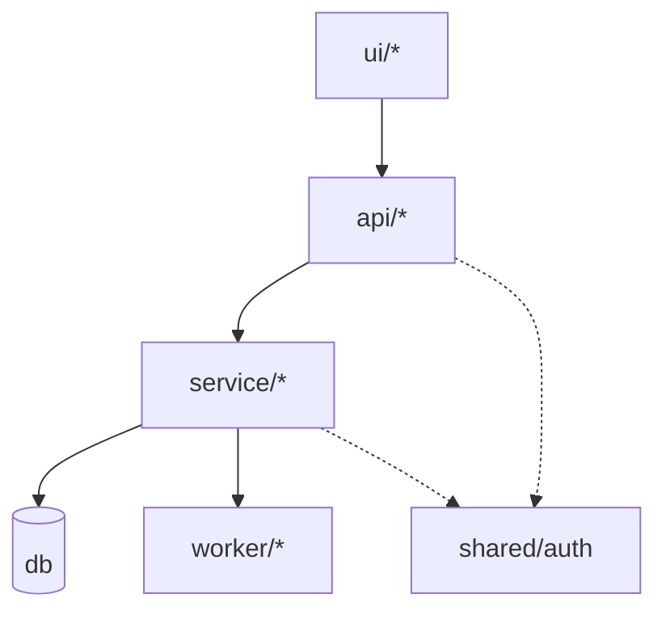

# Architecture Snapshot

**Updated:** YYYY-MM-DD · **Budget:** 150 lines target / 200 hard ceiling

> The orientation document. A developer or agent reads this file and nothing else, and knows
> what exists and how it fits together. Detail belongs in the per-spec artifacts; see
> `.claude/spec-kit/meta-maintenance.md` for what may and may not live here.
>
> Maintained by `/implement` via surgical edits. Never regenerate this file.

---

## Purpose

<2-3 sentences. What the system does, for whom, and the single defining constraint.>

## Tech Stack

| Layer | Technology | Notes |
|---|---|---|
| Frontend | | |
| Backend | | |
| Database | | |
| Auth | | |
| Infrastructure | | |
| Testing | | |

Detail and exact versions live in `tech-stack.md`.

## Component Map



| Component | Responsibility | Owning specs |
|---|---|---|
| `ui/<area>` | | |
| `api/<area>` | | |
| `service/<area>` | | |
| `db/<area>` | | |
| `shared/auth` | | |

This table is the authoritative list of component paths (see `conventions.md` §5).

## Data Model

Entities and relationships only. Columns live in each spec's `plan/erd.md`.

```mermaid
erDiagram
```

## Cross-Cutting Concerns

| Concern | Mechanism | Implemented in |
|---|---|---|
| Authentication | | |
| Authorization | | |
| Validation | | |
| Error handling | | |
| Logging & tracing | | |
| Configuration | | |
| Background work | | |

## Integration Points

| Service | Purpose | Direction | Owning spec |
|---|---|---|---|
| | | | |

<If none yet: "None — the system has no external integrations.">

## Layering Rules

The constraints `/validate` checks against. Keep to five or fewer.

1. `ui/*` talks only to `api/*` over HTTP. No direct database access.
2. `api/*` depends on `service/*`, never on persistence directly.
3. `service/*` owns transactions and business rules.
4. `shared/*` may be depended on by anything and depends on nothing.
5. `worker/*` is triggered by events, never called synchronously from `api/*`.

## Change Log

| Date | Spec | Change |
|---|---|---|
| YYYY-MM-DD | — | Blueprint initialised by /initialize-project |
