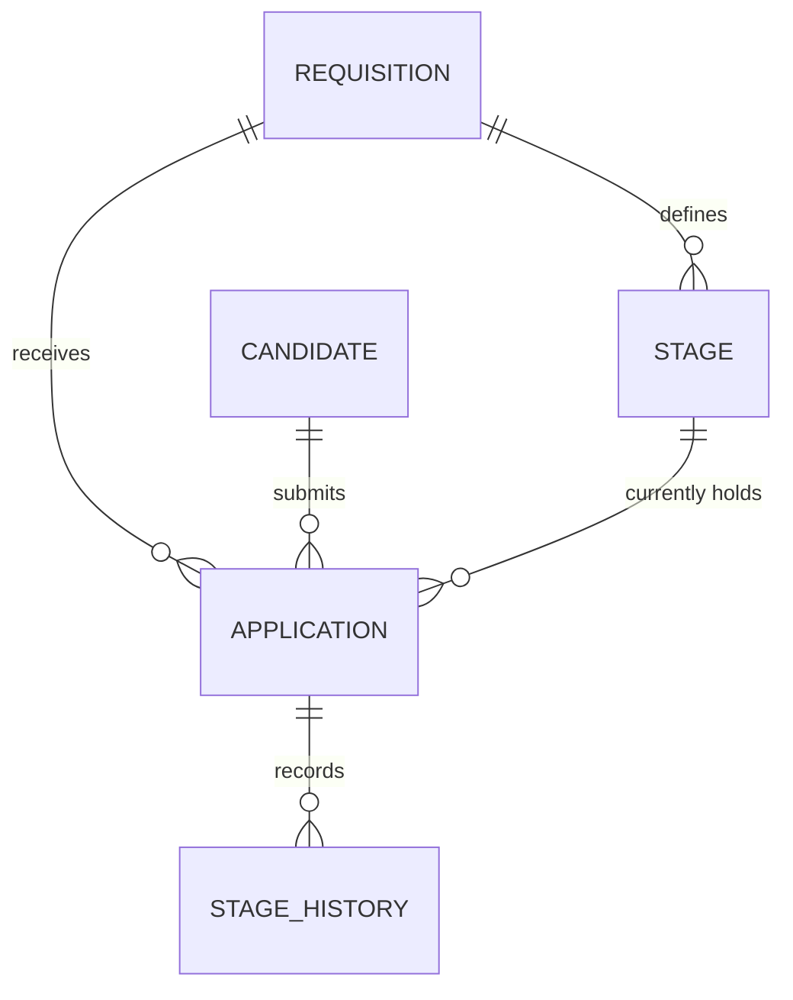

# Data Model — NNNN <Title>

**Spec:** `../spec.md` · **Updated:** YYYY-MM-DD

> **Model inheritance.** Read `plan/erd.md` of the Tier-1 specs first. Reuse existing entity
> names, key types, audit-column conventions, and naming style. Never redefine an entity that
> already exists — reference it and describe only your delta.

---

## 1. Diagram

Entities this spec touches, plus their immediate neighbours for orientation.
Existing entities are marked in the table below, not in the diagram.

## 2. Delta Summary

The most important section — what changes relative to the current model in
`meta/architecture.md`.

| Change | Entity | Detail |
|---|---|---|
| New table | `STAGE_HISTORY` | Append-only audit of stage transitions |
| Altered table | `APPLICATION` | Adds `current_stage_id`, `row_version` |
| Unchanged (referenced) | `CANDIDATE` | Read-only here — no schema change |

## 3. Table Definitions

Only for new or altered tables. Do not restate unchanged tables.

### 3.1 `stage_history` *(new)*

| Column | Type | Null | Default | Notes |
|---|---|---|---|---|
| `id` | uuid | No | `gen_random_uuid()` | PK |
| `application_id` | uuid | No | | FK → `application.id`, ON DELETE CASCADE |
| `from_stage_id` | uuid | Yes | | FK → `stage.id`; null on first entry |
| `to_stage_id` | uuid | No | | FK → `stage.id` |
| `changed_by` | uuid | No | | FK → `user.id` |
| `changed_at` | timestamptz | No | `now()` | |

**Indexes**

| Name | Columns | Type | Rationale |
|---|---|---|---|
| `ix_stage_history_application_changed` | `(application_id, changed_at DESC)` | btree | Timeline query, NFR-1 |

**Constraints**

- `ck_stage_history_distinct`: `from_stage_id IS DISTINCT FROM to_stage_id`

**Retention.** Append-only; never updated or deleted while the application exists.

### 3.2 `application` *(altered)*

| Column | Change | Type | Null | Notes |
|---|---|---|---|---|
| `current_stage_id` | Added | uuid | No (after backfill) | FK → `stage.id` |
| `row_version` | Added | bytea | No | Optimistic concurrency |

## 4. Relationships

| From | To | Cardinality | On delete | Notes |
|---|---|---|---|---|
| `application` | `stage` | many-to-one | RESTRICT | A stage in use cannot be deleted |

## 5. Migrations

Ordered, each individually reversible.

| # | Operation | Reversible | Backfill | Downtime |
|---|---|---|---|---|
| 1 | `ALTER TABLE application ADD current_stage_id uuid NULL` | Yes | — | None |
| 2 | Backfill from `application.status` mapping | Yes | Yes, batched 5k | None |
| 3 | `SET NOT NULL` + add FK + index | Yes | — | Brief lock |

**Rollback plan.** <How to reverse if step 3 fails in production.>

## 6. Data Volume & Growth

| Table | Initial rows | Growth | Notes affecting indexing |
|---|---|---|---|
| `stage_history` | 0 | ~6 rows per application | Grows fastest; partition candidate beyond 50M |

## 7. Seed / Reference Data

| Table | Rows | Source |
|---|---|---|
| `stage` | Default 6-stage pipeline template | Migration seed |

## 8. PII & Retention

| Column | Classification | Retention | Deletion path |
|---|---|---|---|
| `candidate.email` | PII | 24 months after last activity | GDPR erase job anonymises |

## Related Specs

<Per spec-kit/context-loading.md §4.>
