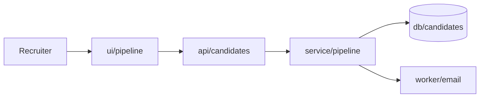
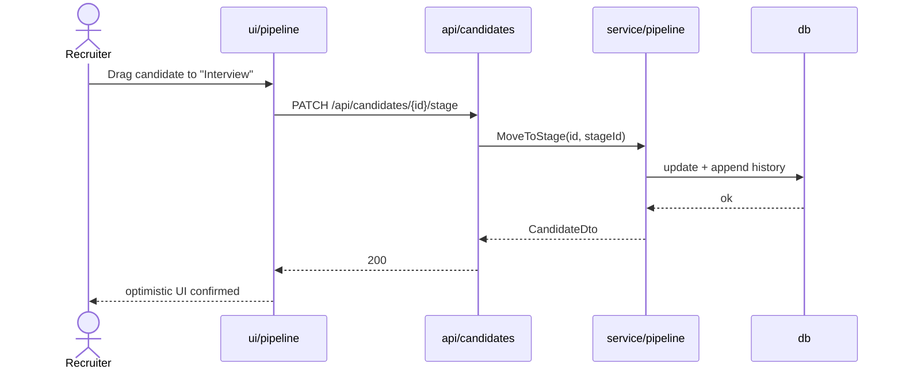

# High-Level Design — NNNN <Title>

**Spec:** `../spec.md` · **Status:** planned · **Updated:** YYYY-MM-DD

The *what and why* of the design. Someone should be able to read this alone and understand
the shape of the solution and the reasoning behind it, without reading the LLD.

---

## 1. Solution Overview

<3-5 sentences. The approach in plain language, and the single most important design decision.>

## 2. Context Diagram

How this feature sits inside the existing system. Show only what it touches.



## 3. Components

| Component | New/Modified | Responsibility | Key collaborators |
|---|---|---|---|
| `api/candidates` | Modified | <one line> | `service/pipeline` |

## 4. Key Flows

One sequence diagram per significant flow. Include the failure path for at least one.

### 4.1 <Flow name> *(AC-1, AC-2)*



### 4.2 <Failure flow> *(E-1)*

```mermaid
sequenceDiagram
  ...
```

## 5. Design Decisions

| # | Decision | Alternatives considered | Rationale |
|---|---|---|---|
| D-1 | <chosen approach> | <what else was on the table> | <why this one — cite a constraint from meta/architecture.md or a prior spec where relevant> |

Record decisions that a reviewer might question. If there was only ever one sensible option,
it is not a decision worth logging.

## 6. Data Model Impact

Summary only — the detail is in `erd.md`.

- New entities: <Entity, Entity>
- Modified entities: <Entity — added `field`>
- Migrations required: <yes/no, and whether backfill is needed>

## 7. Non-Functional Approach

| NFR | How the design satisfies it |
|---|---|
| NFR-1 <p95 < 300ms> | <index on (requisitionId, stageId); list endpoint paginated at 50> |

## 8. Security & Authorization

- **Who can do what:** <role → permitted operations>
- **Enforcement point:** <where the check lives, referencing meta/architecture.md cross-cutting section>
- **Data exposure:** <any PII in responses, and how it is limited>

## 9. Risks & Mitigations

| # | Risk | Likelihood | Impact | Mitigation |
|---|---|---|---|---|
| R-1 | <e.g. stage reordering races> | Medium | Medium | <optimistic concurrency on rowVersion> |

## 10. Rollout Considerations

- Migration order and reversibility
- Feature flag needed? <yes/no + name>
- Backward compatibility with existing clients

## Related Specs

<Per spec-kit/context-loading.md §4.>
