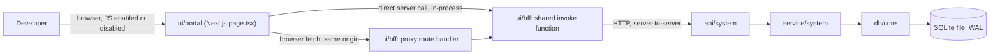
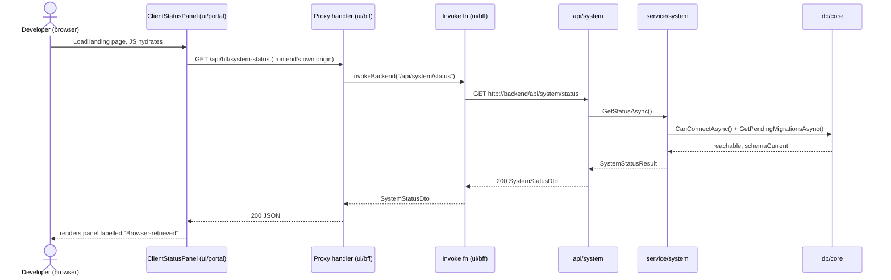
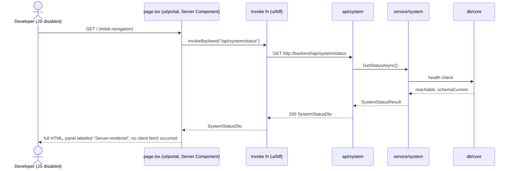
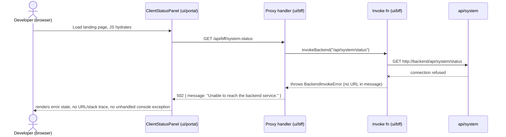
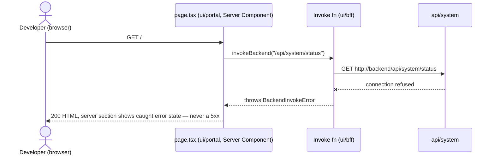

# High-Level Design — 0001 Project Scaffolding and Walking Skeleton

**Spec:** `../spec.md` · **Status:** planned · **Updated:** 2026-08-05

The *what and why* of the design. Someone should be able to read this alone and understand
the shape of the solution and the reasoning behind it, without reading the LLD.

---

## 1. Solution Overview

Two deployables are stood up from nothing: an ASP.NET Core 10 backend split into four
class-library projects whose project-reference topology makes three of the four Layering
Rule violations a compile error, backed by a fourth automated check (a reflection-based
architecture test folded into the documented Build command) that catches the one violation
project topology cannot — `db/core` reading `ClaimsPrincipal`. A Next.js 15 frontend calls
that backend through exactly one shared server-side function (`ui/bff`'s invoke function),
which both a browser-facing proxy route handler and a server-rendered page call; the browser
never learns the backend exists. The single most important design decision is that this
invoke function, not the proxy handler, is the sole place an outbound backend call is ever
constructed — established now, while it attaches no token, so spec `0002` fills one seam
instead of rewriting call sites.

## 2. Context Diagram

## 3. Components

| Component | New/Modified | Responsibility | Key collaborators |
|---|---|---|---|
| `infra/build` | New | Repo-level tooling: ignore rules, version pinning, lockfiles, lint/format config, the documented command set, and the project-reference topology that makes Layering Rules 2–5 mostly unsatisfiable by construction | all others |
| `db/core` | New | `AppDbContext` (no `DbSet`s — schema deliberately empty), SQLite WAL + busy-timeout connection interceptor, empty initial migration, database-reachability check | `service/system` (sole caller) |
| `service/system` | New | `SystemStatusService` — the only caller of `db/core`; assembles version + database health into one result | `api/system`, `db/core` |
| `api/system` | New | HTTP boundary: `GET /api/system/status`, ProblemDetails error handler, typed configuration with fail-fast validation, structured logging | `service/system` |
| `ui/bff` | New | Both the browser-facing proxy route handler and the shared server-side invoke function that is the sole constructor of outbound backend calls and sole reader of the backend base URL | `api/system` (over HTTP), `ui/portal` (its two callers) |
| `ui/portal` | New (route group) | Anonymous landing page: a Server Component calling `ui/bff`'s invoke function directly, and a Client Component calling `ui/bff`'s proxy handler, each labelled by route, each with loading/error/success states | `ui/bff` |

`ui/staff` receives an empty route group directory only, per the spec's Impacted Components
table — no component row above, no behaviour.

## 4. Key Flows

### 4.1 Browser-retrieved status *(AC-12, AC-13, FR-8)*

### 4.2 Server-rendered status *(AC-28, AC-29, FR-17)*

### 4.3 Failure — backend down, browser route *(AC-15, E-3)*

### 4.4 Failure — backend down, server-rendered route *(AC-30, E-9)*

## 5. Design Decisions

| # | Decision | Alternatives considered | Rationale |
|---|---|---|---|
| D-1 | Layering enforced by (a) project-reference topology, (b) non-Web SDK for `service/system` and `db/core` denying ASP.NET Core namespace resolution, and (c) one reflection-based xUnit architecture-test project (`Ats.ArchitectureTests`) whose run is folded into the documented **Build** command | `NetArchTest.Rules`/ArchUnitNET package (new dependency, rejected); custom Roslyn analyzer package (larger new-package surface for one narrow gap); code review only (the spec exists specifically to reject this) | (a)+(b) turn three of AC-7's four cases into genuine `dotnet build` compiler errors (CS0246) at zero extra cost. Only `db/core` reading `ClaimsPrincipal` survives both, because `System.Security.Claims` ships in the base shared framework every project already references. Folding the architecture-test run into **Build** (`dotnet build && dotnet test tests/Ats.ArchitectureTests --no-build`) is what makes AC-7's literal "the backend build fails" true for that fourth case too, using only xUnit (already decided) |
| D-2 | Composition root registers the DB context via nested extension methods (`AppDbContext`'s `AddDbCore` called from `service/system`'s `AddSystemService`, called from `Program.cs`), rather than `Program.cs` calling `AddDbCore` itself | `Api` project references `Db` project directly for DI wiring | The alternative would give `api/system` a real `ProjectReference` to `db/core`, defeating D-1's compile-error guarantee for Rule 2 even though no controller code touches `db/*`. Nesting the registration keeps `api/system`'s only `ProjectReference` as `service/system` |
| D-3 | The server-rendered status section is **not** wrapped in a React Suspense boundary; `page.tsx` `await`s the invoke call inline | Suspense + streaming SSR, consistent with the client panel's async pattern | Suspense-streamed content is patched into the DOM by an inline `<script>` that runs client-side (React's selective hydration). With scripting disabled (AC-28's scenario) that patch never executes and only the fallback would ever be visible — silently failing the AC. Awaiting inline forces a fully-rendered response before any bytes are sent, which is what AC-28 requires |
| D-4 | FR-16's "constructed nowhere else" rule is enforced with two **built-in** ESLint rules — `no-restricted-properties` blocking any `.API_BASE_URL` property access outside the invoke module, and `no-restricted-syntax` blocking any `fetch(` call expression outside it (both via `overrides` scoped to the one file) | A dedicated import-boundary ESLint plugin (e.g. `eslint-plugin-boundaries`) | Both target rules ship with ESLint itself — no new package, and the two rules independently cover "reads the base URL" and "constructs a request," which together are what FR-16 and AC-26 describe |
| D-5 | EF Core design-time tooling resolves `AppDbContext` via `IDesignTimeDbContextFactory<AppDbContext>` implemented inside `db/core` itself, so `dotnet ef` runs directly against `Db.csproj` with no startup project | Use `Api.csproj` as the `dotnet ef` startup project | The startup-project approach requires `dotnet ef` to load `Api`'s DI container, which would need `Api` to reference `Db` — again defeating D-1 |
| D-6 | An empty `Ats.Shared` class library is created purely so Rule 5 ("shared-layer dependency on api/service/db") is a real, testable case in `Ats.ArchitectureTests` | Skip creating it since no `shared/*` component is listed in the spec's Impacted Components table, and treat Rule 5 as untestable this spec | AC-7 explicitly enumerates the shared-layer case as something the build must reject. Without a project to reference, that assertion has nothing to check. The project ships with no code and no responsibility — it is infrastructure for D-1, not the `shared/auth` or `shared/storage` component from `architecture.md` |
| D-7 | `GET /api/system/status` returns `200` with a plain DTO when the database is reachable and schema-current, and `503` as an RFC 7807 ProblemDetails body (using `Extensions` to carry `version` and `database`) when it is not | Always `200`, with a body-level `healthy` flag | Matches standard health-check HTTP semantics and keeps ProblemDetails as the envelope for every non-2xx response per `coding-standards.md`, while still satisfying AC-11's requirement to report the degraded state in the body |
| D-8 | The frontend fails the specific request that needs `API_BASE_URL` (inside the invoke function) rather than a dedicated process-startup hook | `instrumentation.ts` `register()` hook validating at process boot | AC-21 explicitly accepts either "startup or the first proxied request fails" — the request-time check is simpler, requires no experimental Next.js API, and the failure still names the missing key before any undefined-address request is attempted |
| D-9 | Migrations are never applied automatically at process startup; `dotnet ef database update` is the only thing that changes schema | Auto-migrate inside `Program.cs` on boot | FR-9 calls for "one documented migration command" as the schema-change mechanism. Auto-migrating on every boot would make that command redundant and would apply schema changes without the review `tech-stack.md` requires for every migration |

## 6. Data Model Impact

Summary only — the detail is in `erd.md`.

- New entities: none. `entities: []` stays as spec'd; `architecture.md`'s ER diagram stays empty.
- Modified entities: none.
- Migrations required: yes — one empty initial migration, proving the toolchain and creating
  EF Core's own `__EFMigrationsHistory` table. No domain schema object is created.

## 7. Non-Functional Approach

| NFR | How the design satisfies it |
|---|---|
| NFR-1 (WAL + ≥5000ms busy timeout) | `SqlitePragmaConnectionInterceptor.ConnectionOpened(Async)` executes `PRAGMA journal_mode=WAL; PRAGMA busy_timeout=5000;` on every connection open, registered once in `AddDbCore` |
| NFR-2 (backend: zero warnings, warnings as errors) | `Directory.Build.props` sets `TreatWarningsAsErrors=true`, `AnalysisLevel=latest`, `EnforceCodeStyleInBuild=true` repo-wide for every backend project |
| NFR-3 (frontend: TypeScript strict, zero errors) | `tsconfig.json` sets `"strict": true`; `next build` runs the TypeScript compiler and fails the build on any type error by default (no `ignoreBuildErrors` override) |

## 8. Security & Authorization

- **Who can do what.** Everyone, unauthenticated — `GET /api/system/status` is the only
  endpoint this spec ships, and it is explicitly anonymous (`.AllowAnonymous()` declared
  inline, per `coding-standards.md`'s "anonymous access is explicit, justified in the spec"
  rule, even though no authentication middleware exists yet to be anonymous *from*).
- **Enforcement point.** None needed this spec — no `ClaimsPrincipal`, no role check, no
  `shared/auth`. Spec `0002` adds the first authorization policy.
- **Data exposure.** The response carries a version string and two booleans; no PII, no file
  path, no connection string. AC-11 is satisfied by `EfDatabaseHealthCheck` catching every
  exception internally and returning `Reachable: false` rather than letting connection
  details reach the ProblemDetails body — they may still reach the server log (permitted;
  only response bodies are constrained here).
- **Credential seam.** `invokeBackend` carries a comment marking where `0002` attaches a
  bearer token; this spec sends none, and AC-27 asserts no request carries one.

## 9. Risks & Mitigations

| # | Risk | Likelihood | Impact | Mitigation |
|---|---|---|---|---|
| R-1 | The layering-enforcement design (project topology + one architecture-test project) develops a gap as the codebase grows past this scaffold — e.g. a future spec adds a `FrameworkReference` to `db/core` for an unrelated reason, silently reopening the ASP.NET-type gap | Medium | Medium | `Ats.ArchitectureTests` is a permanent, always-run part of the Build command, not a one-time check; any future project-file edit that reopens a gap is caught the next time anyone builds |
| R-2 | SQLite's single-writer constraint makes parallel test runs across `Ats.UnitTests`, `Ats.IntegrationTests`, and any future test project flaky if they ever share a database file | Medium | Medium | `Ats.IntegrationTests` gives every test its own uniquely-named temp SQLite file (AC-18), never a shared path |
| R-3 | Folding `Ats.ArchitectureTests` into the documented **Build** command (rather than a **Test** row) is unconventional and could confuse a future contributor reading `tech-stack.md` | Low | Low | The compound command and its rationale are documented explicitly in `lld.md` §3 and in this table; `tech-stack.md`'s Build row keeps the literal command visible |
| R-4 | Exact package pins chosen now (Next.js 15.x, EF Core 10.x, xUnit, Vitest) will need bumping soon after this spec ships, and SQLite migrations discovered later may be full table rebuilds if the schema grows carelessly | Low | Low | FR-13's lockfile-mismatch failure (AC-4) makes every future bump an explicit, reviewed diff rather than a silent drift |

## 10. Rollout Considerations

- Migration order: one migration (`InitialCreate`, empty), fully reversible (empty `Down()`).
- Feature flag needed? No — nothing this spec ships is conditionally enabled.
- Backward compatibility: none to preserve — this is the first code in the repository.

## Related Specs

None — this is the first spec touching these components.
