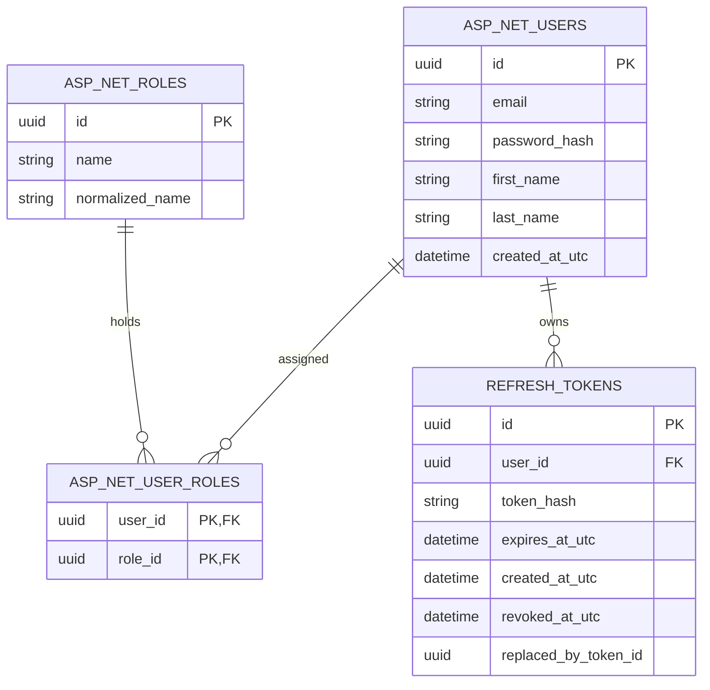

# Data Model — 0002 User Authentication and Refresh Token Flow

**Spec:** `../spec.md` · **Updated:** 2026-08-05

> **Model inheritance.** Read `plan/erd.md` of Spec `0001` first. Spec `0001` established an empty domain model with only `__EFMigrationsHistory`. This spec introduces ASP.NET Core Identity domain entities and the `RefreshToken` table into SQLite EF Core persistence.

---

## 1. Diagram

---

## 2. Delta Summary

| Change | Entity / Table | Detail |
|---|---|---|
| New Table | `AspNetUsers` | ASP.NET Core Identity user accounts |
| New Table | `AspNetRoles` | ASP.NET Core Identity roles (`Candidate`, `Recruiter`, `HiringManager`) |
| New Table | `AspNetUserRoles` | User-to-Role join table |
| New Table | `AspNetUserClaims` | Standard ASP.NET Core Identity claims table |
| New Table | `RefreshTokens` | Custom entity tracking refresh token hashes, expiration, and rotation |
| Unchanged (referenced) | `__EFMigrationsHistory` | Maintained by EF Core migrations |

---

## 3. Table Definitions

### 3.1 `AspNetUsers` *(new)*

| Column | Type | Null | Default | Notes |
|---|---|---|---|---|
| `Id` | TEXT (Guid) | No | | PK |
| `Email` | TEXT | Yes | | User email |
| `NormalizedEmail` | TEXT | Yes | | Uppercase normalized email for $O(1)$ lookup |
| `PasswordHash` | TEXT | Yes | | PBKDF2 hash |
| `FirstName` | TEXT | No | `""` | User given name |
| `LastName` | TEXT | No | `""` | User family name |
| `CreatedAtUtc` | TEXT (DateTime) | No | `CURRENT_TIMESTAMP` | Account creation timestamp |
| `SecurityStamp` | TEXT | Yes | | Identity security stamp |

**Indexes**:

| Name | Columns | Type | Rationale |
|---|---|---|---|
| `IX_AspNetUsers_NormalizedEmail` | `NormalizedEmail` | Unique | $O(1)$ login & duplication lookup |

---

### 3.2 `AspNetRoles` *(new)*

| Column | Type | Null | Default | Notes |
|---|---|---|---|---|
| `Id` | TEXT (Guid) | No | | PK |
| `Name` | TEXT | Yes | | Role name (`Candidate`, `Recruiter`, `HiringManager`) |
| `NormalizedName` | TEXT | Yes | | Uppercase normalized role name |

---

### 3.3 `RefreshTokens` *(new)*

| Column | Type | Null | Default | Notes |
|---|---|---|---|---|
| `Id` | TEXT (Guid) | No | | PK |
| `UserId` | TEXT (Guid) | No | | FK → `AspNetUsers.Id`, ON DELETE CASCADE |
| `TokenHash` | TEXT | No | | SHA-256 hash of random refresh token string |
| `ExpiresAtUtc` | TEXT (DateTime) | No | | Expiration timestamp |
| `CreatedAtUtc` | TEXT (DateTime) | No | `CURRENT_TIMESTAMP` | Creation timestamp |
| `RevokedAtUtc` | TEXT (DateTime) | Yes | `NULL` | Timestamp when revoked |
| `ReplacedByTokenId` | TEXT (Guid) | Yes | `NULL` | ID of successor token upon rotation |

**Indexes**:

| Name | Columns | Type | Rationale |
|---|---|---|---|
| `IX_RefreshTokens_TokenHash` | `TokenHash` | Unique | $O(1)$ refresh token exchange lookup |
| `IX_RefreshTokens_UserId` | `UserId` | Non-unique | $O(1)$ user session token retrieval & revocation |

---

## 4. Relationships

| From | To | Cardinality | On Delete | Notes |
|---|---|---|---|---|
| `RefreshTokens` | `AspNetUsers` | Many-to-One | CASCADE | Deleting a user revokes all refresh tokens |
| `AspNetUserRoles` | `AspNetUsers` | Many-to-One | CASCADE | Deleting a user removes role assignments |
| `AspNetUserRoles` | `AspNetRoles` | Many-to-One | CASCADE | Role join table relation |

---

## 5. Migrations

| # | Operation | Reversible | Backfill | Downtime |
|---|---|---|---|---|
| 1 | Run `dotnet ef migrations add AddAuthenticationAndRefreshTokens --project src/Db` | Yes | — | None |
| 2 | Run `dotnet ef database update --project src/Db` | Yes | Seed roles | None |

**Rollback Plan**: Execute `dotnet ef database update InitialCreate --project src/Db` to revert schema back to the empty initial state.

---

## 6. Data Volume & Growth

| Table | Initial Rows | Growth Rate | Notes |
|---|---|---|---|
| `AspNetUsers` | 0 | ~100s per month | Primary identity records |
| `RefreshTokens` | 0 | ~1 row per login/refresh | Can be pruned periodically (expired & revoked rows older than 30 days) |

---

## 7. Seed / Reference Data

| Table | Seed Data | Source |
|---|---|---|
| `AspNetRoles` | Roles: `Candidate`, `Recruiter`, `HiringManager` | Startup role check / DbContext seed |

---

## 8. PII & Retention

| Column | Classification | Retention | Deletion Path |
|---|---|---|---|
| `AspNetUsers.Email` | PII | Account lifetime | GDPR erasure / Account deletion |
| `AspNetUsers.FirstName` | PII | Account lifetime | GDPR erasure / Account deletion |
| `AspNetUsers.LastName` | PII | Account lifetime | GDPR erasure / Account deletion |
| `AspNetUsers.PasswordHash` | Sensitive Credential | Account lifetime | Destroyed on user deletion |

---

## Related Specs

| Spec | Tier | Why loaded |
|---|---|---|
| `0001` (Project Scaffolding) | Tier 1 | Derived initial EF Core SQLite schema baseline and migration conventions. |
