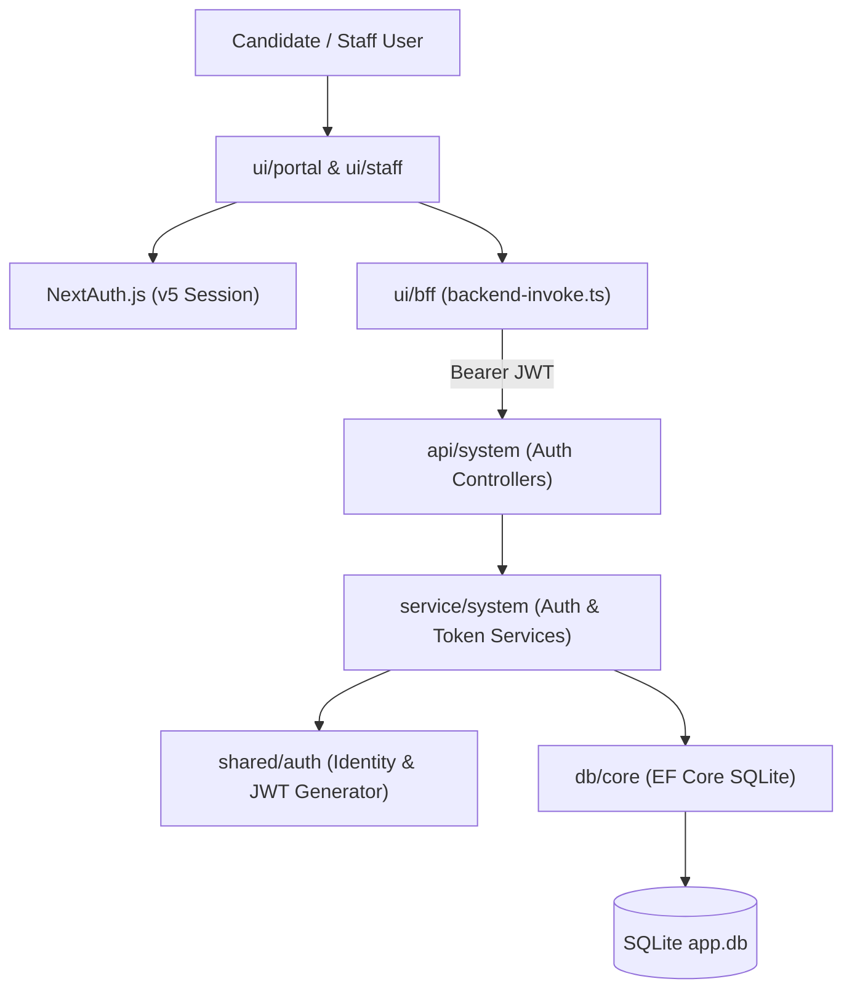
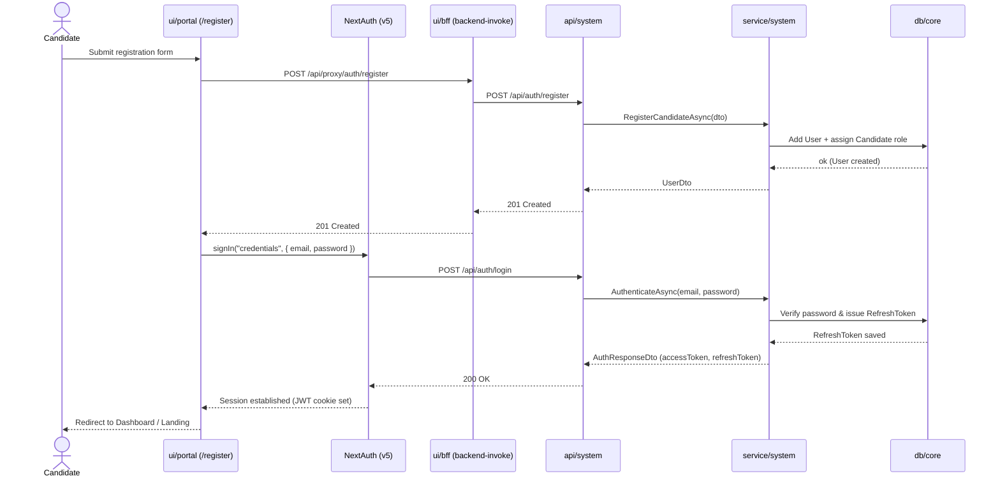
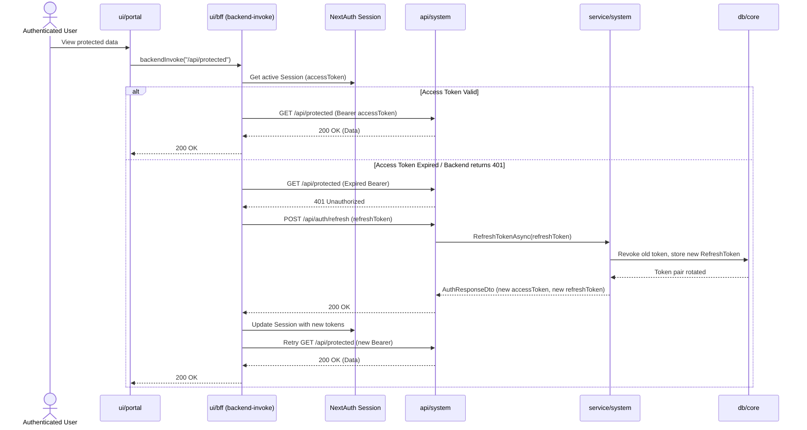
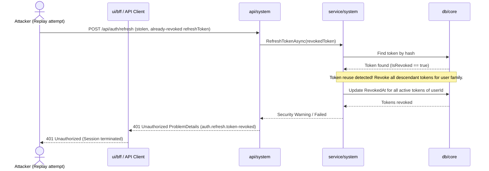

# High-Level Design — 0002 User Authentication and Refresh Token Flow

**Spec:** `../spec.md` · **Status:** planned · **Updated:** 2026-08-05

The *what and why* of the authentication design. Someone should be able to read this document alone and understand the end-to-end authentication architecture, key flows, security boundary, and rationale without reading the low-level implementation details.

---

## 1. Solution Overview

The system delivers end-to-end self-hosted authentication using ASP.NET Core Identity with EF Core SQLite persistence on the backend and NextAuth v5 (Auth.js) on the Next.js frontend. The backend issues short-lived JWT access tokens (15-minute expiry) containing identity and role claims (`Candidate`, `Recruiter`, `HiringManager`) alongside cryptographically random refresh tokens (7-day sliding expiry). Refresh tokens are stored in a dedicated `RefreshToken` entity in SQLite and follow strict token rotation: exchanging a refresh token invalidates it immediately, issues a new token pair, and tracks replacement history to detect and mitigate replay attacks. 

The Next.js frontend manages session state via NextAuth v5 credentials provider, storing backend JWT access and refresh tokens securely in encrypted JWT sessions. Crucially, the `ui/bff` seam established in Spec `0001` (`backend-invoke.ts`) automatically extracts access tokens from NextAuth sessions to attach `Authorization: Bearer <access_token>` headers on outbound HTTP requests, and transparently executes token refresh when tokens expire or when 401 Unauthorized responses occur.

---

## 2. Context Diagram

---

## 3. Components

| Component | New/Modified | Responsibility | Key collaborators |
|---|---|---|---|
| `shared/auth` | New | ASP.NET Core Identity store configuration, JWT bearer token generator service, password validation, role policy definitions. | `db/core` |
| `db/core` | Modified | Houses `AppDbContext` containing ASP.NET Core Identity tables (`AspNetUsers`, `AspNetRoles`, `AspNetUserRoles`) and `RefreshTokens` entity. | SQLite File |
| `service/system` | Modified | Implements business logic for `IAuthService` (user registration, credential authentication, refresh token exchange, revocation). | `shared/auth`, `db/core` |
| `api/system` | Modified | Exposes authentication controller endpoints (`POST /api/auth/register`, `POST /api/auth/login`, `POST /api/auth/refresh`, `POST /api/auth/logout`, `GET /api/auth/me`), registers JWT authentication bearer scheme and authorization policies. | `service/system` |
| `ui/bff` | Modified | Updates `backend-invoke.ts` to retrieve NextAuth session, append `Authorization` bearer token, and handle automatic refresh flow when tokens expire or return 401. | NextAuth.js |
| `ui/portal` | Modified | Integrates NextAuth v5 session provider, login page (`/login`), candidate registration page (`/register`), and session-aware navigation header. | `ui/bff` |

---

## 4. Key Flows

### 4.1 Candidate Registration & Initial Login *(AC-1, AC-4, AC-12, AC-13)*

### 4.2 Authenticated Request with Automatic Token Refresh *(AC-6, AC-14, AC-15)*

### 4.3 Failure Flow: Revoked Refresh Token Replay / Reuse Detection *(AC-7, E-1)*

---

## 5. Design Decisions

| # | Decision | Alternatives considered | Rationale |
|---|---|---|---|
| D-1 | NextAuth v5 (Auth.js) Credentials Provider with encrypted JWT session strategy | NextAuth v4 or custom React Context token storage | NextAuth v5 provides App Router-native Server Component and Route Handler session management, encrypting tokens inside HTTP-only cookies without client script access. |
| D-2 | Dedicated EF Core `RefreshToken` entity in SQLite with rotation history | ASP.NET Core `AspNetUserTokens` table or stateless JWT refresh tokens | Dedicated `RefreshToken` entity allows tracking token families (`ReplacedByTokenId`), explicit revocation timestamps, and replay attack mitigation per RFC 6819 security recommendations. |
| D-3 | Candidate-only public registration (`/api/auth/register`) | Single endpoint accepting role input parameter | Prevents unauthorized privilege escalation. Staff accounts (`Recruiter`, `HiringManager`) must be provisioned via admin endpoints or database seeding. |
| D-4 | Centralized token attachment and auto-refresh inside `backend-invoke.ts` | Next.js Middleware token injection | Fulfills FR-16 established in Spec `0001`. `backend-invoke.ts` is the single point through which both proxy handlers and Server Components reach the backend. |

---

## 6. Data Model Impact Summary

- **New Entities**:
  - `User` (`AspNetUsers`): ASP.NET Core Identity user record (`Id`, `Email`, `PasswordHash`, `FirstName`, `LastName`, `CreatedAt`).
  - `Role` (`AspNetRoles`): Identity role record (`Candidate`, `Recruiter`, `HiringManager`).
  - `UserRole` (`AspNetUserRoles`): User-to-Role join table.
  - `RefreshToken`: Token entity (`Id`, `UserId`, `TokenHash`, `ExpiresAt`, `CreatedAt`, `RevokedAt`, `ReplacedByTokenId`).
- **Migrations Required**: Yes — single EF Core migration (`AddAuthenticationAndRefreshTokens`) introducing Identity tables and `RefreshTokens` table in SQLite.

---

## 7. Non-Functional Approach

| NFR | How the design satisfies it |
|---|---|
| NFR-1 (PBKDF2 Password Hashing) | ASP.NET Core Identity `PasswordHasher<TUser>` uses PBKDF2 with HMAC-SHA256 and 100,000+ iterations by default. Plaintext passwords never persist. |
| NFR-2 (256-bit Cryptographic Randomness) | Refresh tokens generated using `RandomNumberGenerator.GetBytes(32)` converted to URL-safe base64 strings. Stored in DB as SHA256 hashes. |
| NFR-3 (Response < 200ms at p95) | SQLite index `IX_RefreshTokens_TokenHash` enables $O(1)$ token lookup. JWT signing uses HMAC-SHA256 (symmetric key). |
| NFR-4 (RFC 7807 ProblemDetails) | ASP.NET Core global ProblemDetails error handler formats all authentication failures into standard RFC 7807 payloads. |

---

## 8. Security & Authorization

- **Role Policies**:
  - `Candidate`: Access to candidate self-service portal endpoints (view own applications, apply for requisitions).
  - `Recruiter` / `HiringManager`: Access to staff workspace endpoints (manage requisitions, view applicant pipelines). Mutually exclusive with `Candidate` claims.
- **Enforcement Point**: Backend ASP.NET Core `[Authorize]` attributes and policy builders at `api/system` boundary (`shared/auth`).
- **Token Security**: JWT access tokens are signed using `Jwt:SigningKey` with HMAC-SHA256. Access tokens live for 15 minutes. Refresh tokens live for 7 days.
- **Replay Attack Mitigation**: When a revoked refresh token is presented to `/api/auth/refresh`, all active tokens belonging to that user family are revoked immediately.

---

## 9. Risks & Mitigations

| # | Risk | Likelihood | Impact | Mitigation |
|---|---|---|---|---|
| R-1 | SQLite single-writer contention during high concurrent login/refresh traffic | Low | Medium | SQLite WAL mode enabled with busy timeout set to >= 5000ms (`db/core` interceptor from Spec `0001`). Short database transaction scope for token updates. |
| R-2 | Refresh token theft / replay attack | Low | High | Strict token rotation (revoked on exchange) and token family revocation upon detecting duplicate refresh token presentation. |
| R-3 | Frontend NextAuth session desynchronization after backend revocation | Low | Low | `backend-invoke.ts` clears session and forces redirect to `/login` whenever token refresh returns 401 Unauthorized. |

---

## 10. Rollout Considerations

- **Database Migration**: Run `dotnet ef database update --project src/Db` to apply Identity and `RefreshTokens` schema updates to `app.db`.
- **Required Configuration Keys**:
  - Backend: `Jwt:Issuer` ("D4FAPE-ATS"), `Jwt:Audience` ("D4FAPE-ATS-App"), `Jwt:SigningKey` (min 256-bit key).
  - Frontend: `AUTH_SECRET` (NextAuth encryption secret), `API_BASE_URL` (http://localhost:5000).

---

## Related Specs

| Spec | Tier | Why loaded |
|---|---|---|
| `0001` (Project Scaffolding) | Tier 1 | Derived `ui/bff` proxy route structure, `backend-invoke.ts` pattern, backend `api/system` routing, and SQLite `db/core` setup. |
