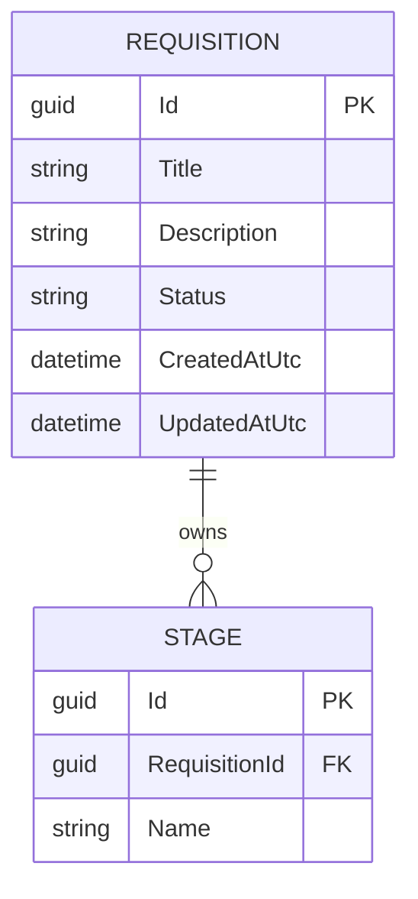

# Data Model — 0003 Requisition Management

**Spec:** `../spec.md` · **Updated:** 2026-08-05

> **Model inheritance.** Read `plan/erd.md` of `0001` and `0002` first. `0002` established
> `AspNetUsers`/`AspNetRoles` (PascalCase tables, `TEXT`-typed `Guid` PKs, `*AtUtc` timestamp
> naming) and the custom `RefreshTokens` table pattern (an EF Core entity outside the
> Identity-generated set, configured via `IEntityTypeConfiguration<T>`). This spec's two new
> tables follow both conventions directly.

---

## 1. Diagram

No existing entity is touched or referenced by foreign key. `AspNetUsers` (Recruiter /
HiringManager identities) is not related to `Requisition` by any column — per Clarification
C-2 and the spec's Non-Goals, there is no per-recruiter ownership/ scoping in this spec; any
Recruiter may edit any Requisition. A `CreatedByUserId` audit column was considered and
explicitly left out — see Design Decision note below.

> **Assumption:** `Requisition` carries no owning-user column. Nothing in FR-1..FR-14 asks
> for per-recruiter scoping or authorship display, and adding one would be designing beyond
> the spec's stated scope. Low cost to add later — it is a purely additive column.

## 2. Delta Summary

| Change | Entity | Detail |
|---|---|---|
| New table | `Requisitions` | Content fields (`Title`, `Description`), `Status` lifecycle, audit timestamps |
| New table | `Stages` | One independent row set per Requisition (FR-14) — ownership shape only, no ordering/behaviour column yet (deferred to the pipeline spec) |
| Unchanged (referenced, not modified) | `AspNetUsers`, `AspNetRoles` | Recruiter/HiringManager identity and role rows this spec's authorization consumes unchanged, per `0002`'s `RecruiterOnly`/`StaffOnly` policies. No column added, no FK added. |

## 3. Table Definitions

### 3.1 `Requisitions` *(new)*

| Column | Type | Null | Default | Notes |
|---|---|---|---|---|
| `Id` | TEXT (Guid) | No | | PK |
| `Title` | TEXT | No | | Max 200 chars, enforced at `api`/`service` validation (not a DB `CHECK`) |
| `Description` | TEXT | No | | Unbounded `TEXT`; SQLite has no practical length ceiling, none enforced at the DB layer |
| `Status` | TEXT | No | `'Draft'` | Stored as the C# enum name (`Draft` \| `Published` \| `Closed`) via `HasConversion<string>()`, matching how `AspNetRoles.Name` stores `Recruiter`/`HiringManager` as plain strings rather than an integer code |
| `CreatedAtUtc` | TEXT (DateTime) | No | | Set once at creation |
| `UpdatedAtUtc` | TEXT (DateTime) | No | | Refreshed on every content edit and every lifecycle transition |

**Indexes**

| Name | Columns | Type | Rationale |
|---|---|---|---|
| `IX_Requisitions_Status` | `Status` | Non-unique | The public list/detail endpoints filter `WHERE Status = 'Published'` on every anonymous request (FR-10, FR-12, FR-13); this is the hottest query this spec adds. |

**Constraints.** Primary key on `Id`. No `CHECK` constraint on `Status`'s three-value domain —
enforced entirely by the C# enum + service-layer state machine (`service/requisition`), not
the database, consistent with `0002` not adding a DB-level check on role names either.

**Retention.** No delete path exists (`closed` is terminal, per spec Out of Scope). Rows are
retained indefinitely.

### 3.2 `Stages` *(new)*

| Column | Type | Null | Default | Notes |
|---|---|---|---|---|
| `Id` | TEXT (Guid) | No | | PK |
| `RequisitionId` | TEXT (Guid) | No | | FK → `Requisitions.Id`, ON DELETE CASCADE. Set once at creation, never reassigned — this single required FK is what makes FR-14 ("no Stage row shared across more than one Requisition") a structural property rather than a runtime check |
| `Name` | TEXT | No | | Max 200 chars. No `SortOrder`/behaviour column — deferred to the pipeline spec per the spec's Non-Goals; this table only fixes the ownership shape |

**Indexes**

| Name | Columns | Type | Rationale |
|---|---|---|---|
| `IX_Stages_RequisitionId` | `RequisitionId` | Non-unique | FK lookup; also the index the future pipeline spec's board query will need first. |

**Constraints.** Primary key on `Id`. FK `RequisitionId → Requisitions.Id`, `NOT NULL`,
`ON DELETE CASCADE` (symmetry with `RefreshTokens → AspNetUsers`; dormant in practice since
this spec ships no Requisition-delete endpoint).

**Retention.** No independent lifecycle in this spec — rows persist as long as their parent
`Requisition` does; cascade-deleted if the parent is ever deleted (no code path does this
yet).

## 4. Relationships

| From | To | Cardinality | On delete | Notes |
|---|---|---|---|---|
| `Stages` | `Requisitions` | many-to-one | CASCADE | A Stage always belongs to exactly one Requisition; there is no join table and no nullable FK, so sharing a Stage across Requisitions is not representable (AC-23). |

## 5. Migrations

Single migration, pure table creation — no existing table is altered and no data exists at
this schema version to lose.

| # | Operation | Reversible | Backfill | Downtime |
|---|---|---|---|---|
| 1 | `dotnet ef migrations add AddRequisitionsAndStages --project src/Db` generates `CreateTable("Requisitions")`, `CreateTable("Stages")`, and both indexes | Yes — `Down()` drops both tables (in FK-safe order: `Stages` then `Requisitions`) | None | None |
| 2 | `dotnet ef database update --project src/Db` applies it | Yes — `dotnet ef database update <previous migration> --project src/Db` reverses it | None | None — no rows exist to migrate |

**Rollback plan.** Run `dotnet ef database update AddAuthenticationAndRefreshTokens --project src/Db`
(the prior migration) to drop both new tables; no application data is lost since no other
table references `Requisitions`/`Stages` yet.

## 6. Data Volume & Growth

| Table | Initial rows | Growth | Notes affecting indexing |
|---|---|---|---|
| `Requisitions` | 0 | Tens to low hundreds per year for a single organisation | Trivially small; `IX_Requisitions_Status` is sufficient, no partitioning needed |
| `Stages` | 0 | A handful per Requisition once the pipeline spec starts writing to it | No writes from this spec's own code paths — table exists but stays empty until the pipeline spec ships |

## 7. Seed / Reference Data

None. Unlike `0002`'s role seed (a fixed, small enum-like set), `Requisitions`/`Stages` are
pure user-generated content with no reference rows to seed.

## 8. PII & Retention

| Column | Classification | Retention | Deletion path |
|---|---|---|---|
| `Requisitions.Title` / `Requisitions.Description` | Not PII — job-posting content, not personal data | Indefinite (no delete path in this spec) | N/A |
| `Stages.Name` | Not PII | Indefinite | N/A |

No column in either table holds a name, email, or other personal identifier.

## Related Specs

| Spec | Tier | Why loaded |
|---|---|---|
| `0002` (User Authentication and Refresh Token Flow) | 1 | Reused table-naming (PascalCase), `Guid`-as-`TEXT` PK, `*AtUtc` timestamp, and per-entity `IEntityTypeConfiguration<T>` conventions established by `AspNetUsers`/`RefreshTokens`. |
| `0001` (Project Scaffolding and Walking Skeleton) | 1 | Confirmed the empty starting schema (`__EFMigrationsHistory` only) and the EF Core/SQLite migration toolchain this spec's migration follows unchanged. |
