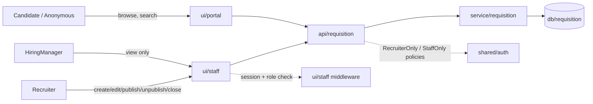
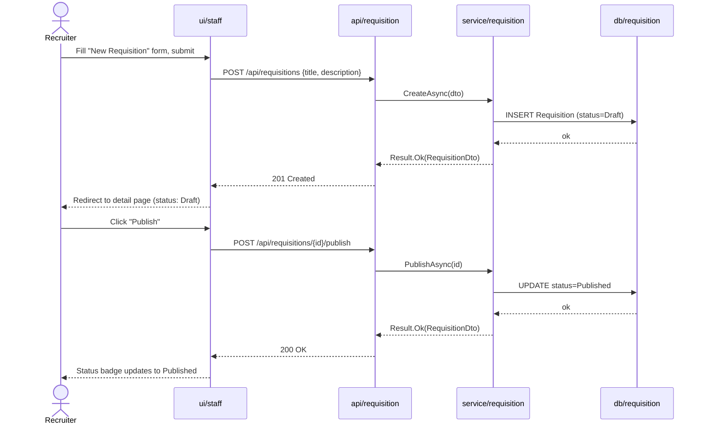
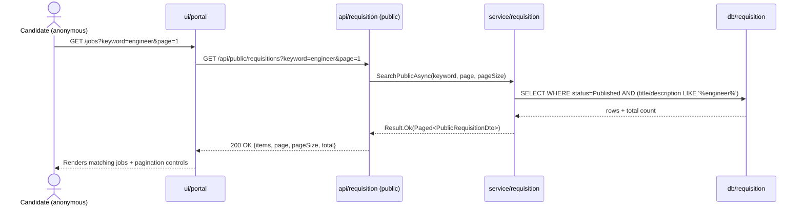
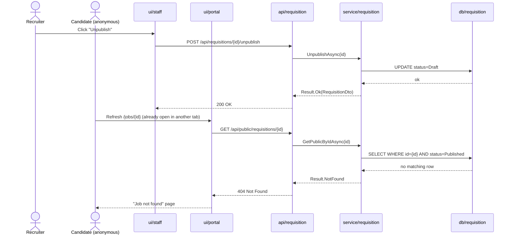
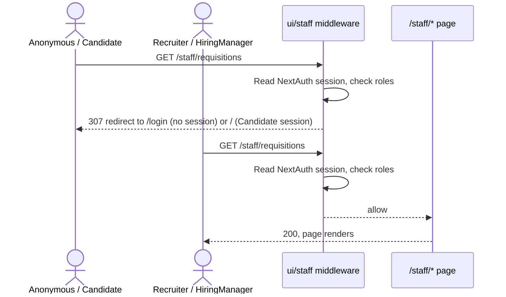

# High-Level Design — 0003 Requisition Management

**Spec:** `../spec.md` · **Status:** planned · **Updated:** 2026-08-05

The *what and why* of the design. Someone should be able to read this alone and understand
the shape of the solution and the reasoning behind it, without reading the LLD.

---

## 1. Solution Overview

A new `Requisition` aggregate (with an owned `Stage` collection fixing FR-14's ownership
shape) is added to the existing single-project layering (`Ats.Db` → `Ats.Service` →
`Ats.Api`), exposed through **two structurally separate endpoint groups under
`api/requisition`**: `/api/requisitions*` (staff, `RecruiterOnly`/`StaffOnly` policies) and
`/api/public/requisitions*` (anonymous, published-only). The frontend gets its first real
code in `ui/staff` — a genuine `/staff` URL segment gated by a new Next.js `middleware.ts`
that implements `0002`'s `E-9` — plus new `/jobs` and `/jobs/[id]` pages in `ui/portal`. The
single most important design decision is keeping the staff and public surfaces on separate
routes and separate service methods rather than one path branching on auth state: it makes
the "draft/closed is never visible to a candidate token" guarantee (FR-13) a structural
property of the code, not a runtime check that could be forgotten.

## 2. Context Diagram

## 3. Components

| Component | New/Modified | Responsibility | Key collaborators |
|---|---|---|---|
| `api/requisition` | New | HTTP boundary: staff CRUD/lifecycle endpoints (`RecruiterOnly`/`StaffOnly`) plus anonymous public list/detail endpoints | `service/requisition` |
| `service/requisition` | New | Requisition state machine, transaction boundary, Stage-ownership shape (FR-14), public query filtering & pagination | `db/requisition` |
| `db/requisition` | New | EF Core `Requisition`/`Stage` entities, configurations, migration | — |
| `ui/staff` | New — first code behind this previously-unowned component | Role-gated `/staff` workspace: requisition list, create, edit, and lifecycle-action pages; the `middleware.ts` implementing `0002`'s `E-9` | `api/requisition` via `ui/bff`, `shared/auth` (NextAuth session) |
| `ui/portal` | Modified | Adds public `/jobs` (search + pagination) and `/jobs/[id]` pages | `api/requisition` via `ui/bff` |

## 4. Key Flows

### 4.1 Recruiter creates and publishes a requisition *(AC-1, AC-3, AC-6)*

### 4.2 Candidate browses and searches the public portal *(AC-16, AC-18, AC-20)*

### 4.3 Failure flow — unpublish removes a requisition from the portal *(AC-7, AC-22, E-1)*

### 4.4 Staff route access control *(AC-14, AC-15, G-4)*

## 5. Design Decisions

| # | Decision | Alternatives considered | Rationale |
|---|---|---|---|
| D-1 | Tables named `Requisitions`/`Stages` (PascalCase), not `requisitions`/`stages` (snake_case) | Follow `coding-standards.md`'s written snake_case rule literally | The schema already shipped by `0002` (`AspNetUsers`, `RefreshTokens`) is PascalCase — ASP.NET Core Identity forces this and `0002`'s own custom `RefreshTokens` table followed suit. Matching what is actually on disk beats an unenforced written rule (`conventions.md` §"Prefer the project's existing patterns"). Flagged for a future `coding-standards.md` correction — see report. |
| D-2 | Two structurally separate endpoint groups: `/api/requisitions*` (staff) and `/api/public/requisitions*` (anonymous) | One path, behaviour branching on whether a bearer token is present | Keeps FR-13's "draft/closed never visible to a candidate" guarantee structural (different service methods, different `AsNoTracking` filters) instead of a single code path that could regress under one bad edit. Establishes `/api/public/*` as the project's convention for every future anonymous portal endpoint. |
| D-3 | `Requisition`/`Stage` entities live in `Ats.Db` (namespace `Ats.Db.Requisitions`), not `Ats.Shared` | Mirror `ApplicationUser`'s placement in `Ats.Shared.Auth` | `ApplicationUser`'s `Shared` placement is an ASP.NET Core Identity-specific exception (`UserManager<TUser>`'s generic constraint forces it across the Api/Service boundary). `Requisition` has no such cross-layer generic requirement, so it follows the plain `db/<area>` ownership `architecture.md`'s Component Map already states. |
| D-4 | `ui/staff` pages live under a real `/staff` URL segment (`src/app/staff/**`), replacing `0001`'s placeholder non-routing `(staff)` route group | Keep `(staff)` as an organisational-only Next.js route group (as `(portal)` already is) | FR-9 and `0002`'s `E-9` both require an actual `/staff` path so `middleware.ts`'s matcher and the redirect ACs (AC-14, AC-15) have something concrete to target. A parenthesised route group produces no URL prefix at all. |
| D-5 | No new frontend data-fetching library. Server Components + `invokeBackend` for reads; client components `fetch`-ing the existing `/api/bff/proxy/*` handler for mutations, followed by `router.refresh()` | Introduce TanStack Query / SWR now that a real CRUD surface exists (`tech-stack.md` leaves "Server state: TBD") | `0001`/`0002` already established and proved this exact pattern (`ServerStatusSection`, `RegisterForm`). This spec's mutations don't need client-side cache invalidation beyond a full refetch, so there is nothing a cache library buys yet — adding one is a decision for a spec that actually needs it. |
| D-6 | Public list `pageSize` is silently clamped to `[1, 50]` (default 20); only `page` is validated and rejected with 400 | Reject an out-of-range `pageSize` with 400 like `page` | FR-11/NFR-1 require the *ceiling* be enforced, not that the caller be scolded for exceeding it — consistent with AC-19's "out-of-range page is 200, not an error" philosophy. Only `page` has an explicit AC (AC-24) demanding a 400. |

## 6. Data Model Impact

Summary only — the detail is in `erd.md`.

- New entities: `Requisition`, `Stage`
- Modified entities: none
- Migrations required: yes, one new migration (`AddRequisitionsAndStages`); no backfill, no existing data at risk

## 7. Non-Functional Approach

| NFR | How the design satisfies it |
|---|---|
| NFR-1 — public list hard-capped at 50/page | `RequisitionService.SearchPublicAsync` clamps the resolved `pageSize` to `Requisitions:MaxPageSize` (default 50) before building the query, regardless of the caller's requested value; unit- and integration-tested (T-11, T-17, T-40). |
| NFR-2 — public GET endpoints never open a write transaction | `GetPublicByIdAsync`/`SearchPublicAsync` issue `AsNoTracking()` LINQ reads only and never call `SaveChangesAsync`; verified by asserting `dbContext.Database.CurrentTransaction == null` after each call (T-41). SQLite's WAL mode (established `db/core`, `0001`) lets these reads proceed without blocking the single writer used by staff mutation endpoints. |

## 8. Security & Authorization

- **Who can do what:** Recruiter — full CRUD + all lifecycle transitions (`RecruiterOnly`). HiringManager — read-only list/get (`StaffOnly`, satisfied by either staff role). Candidate — `403` on every `/api/requisitions*` endpoint (FR-8, AC-2, AC-13); full anonymous read of `/api/public/requisitions*`, published only. Anonymous — same public read access; `/staff/*` UI redirected before render.
- **Enforcement point:** ASP.NET Core `RequireAuthorization(AuthConstants.Policies.*)` at each `api/requisition` endpoint mapping — the policies themselves are unchanged, consumed as shipped by `0002`. This is the **only** real security boundary (`coding-standards.md`: "Staff-only endpoints must be unsatisfiable by a candidate token").
- **Defense in depth, not a boundary:** `ui/staff`'s `middleware.ts` redirect (FR-9) is a UX convenience — it stops a candidate from seeing a staff page render, but every data call the page makes still goes through the same `RecruiterOnly`/`StaffOnly`-protected backend endpoints. See R-2.
- **Data exposure:** `PublicRequisitionDto` never carries a `status` field or any draft/closed content — the public query filters `WHERE Status = Published` server-side before serialization. A non-existent id and a real-but-non-public id return byte-identical 404 responses (AC-22, E-10, per spec Assumption A-5) — no existence leak.

## 9. Risks & Mitigations

| # | Risk | Likelihood | Impact | Mitigation |
|---|---|---|---|---|
| R-1 | SQLite `LIKE '%kw%'` keyword search can't use an index (leading wildcard) and will full-scan `Requisitions` as the catalog grows | Low (single-tenant, small org) | Low | Accepted for this spec's scale; revisit with an SQLite FTS5 virtual table if requisition volume becomes large. |
| R-2 | A future developer relies on the `/staff` middleware redirect as the real security boundary and forgets to protect a new backend endpoint | Medium | High | This plan states explicitly (§8) that `RecruiterOnly`/`StaffOnly` at `api/requisition` is the sole enforcement point; `coding-standards.md` already carries the general rule. |
| R-3 | No optimistic concurrency (spec Assumption A-4) — two Recruiters editing the same requisition concurrently silently last-write-wins | Low (small staff headcount) | Low | Explicitly accepted in the spec; would need a `RowVersion` column added later if concurrent-edit volume becomes real. |

## 10. Rollout Considerations

- Migration order: single new migration (`AddRequisitionsAndStages`), pure `CreateTable` (no existing data touched), reversible via `DropTable` in `Down()`.
- Feature flag needed? No — this is the first code in `ui/staff`; there is nothing to toggle behind.
- Backward compatibility: additive only. No existing endpoint, table, or DTO changes.

## Related Specs

| Spec | Tier | Why loaded |
|---|---|---|
| `0002` (User Authentication and Refresh Token Flow) | 1 | Consumed unchanged: `RecruiterOnly`/`StaffOnly`/`HiringManagerOnly` policies, JWT role claims, `Result`/`ResultStatus` pattern, `AuthEndpoints.ToProblemResult()` mapper, NextAuth session shape (`session.user.roles`). Its `E-9` is the edge case this spec implements (AC-14, AC-15). |
| `0001` (Project Scaffolding and Walking Skeleton) | 1 | Reused unchanged: `/api` base path, ProblemDetails envelope, `ui/bff` proxy route + `invokeBackend`, `(portal)` route-group pattern, Server-Component-for-reads / Client-Component-for-mutations split. |

Tier 0 read in full: `meta/architecture.md`, `meta/tech-stack.md`, `meta/coding-standards.md`, `index.md`.
Considered and skipped: none — only two prior specs exist and both were relevant (cap not reached).
