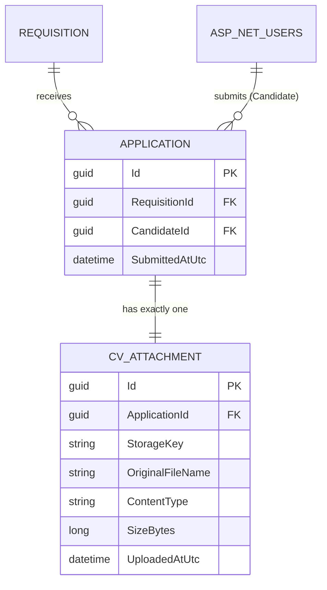

# Data Model — 0004 Application Submission and CV Upload

**Spec:** `../spec.md` · **Updated:** 2026-08-06

> **Model inheritance.** Read `plan/erd.md` of `0001`, `0002`, `0003` first. `0002` established
> `AspNetUsers` (PascalCase tables, `TEXT`-typed `Guid` PKs, `*AtUtc` timestamp naming) and the
> "custom entity outside the Identity-generated set, configured via
> `IEntityTypeConfiguration<T>`" pattern `0003`'s `Requisitions`/`Stages` followed. This spec's
> two new tables follow the same conventions.

---

## 1. Diagram

`Requisition` (`0003`) and `AspNetUsers` (`0002`) are shown only as neighbours — referenced by
foreign key, not modified. Neither gains a column or a navigation property in this spec.

## 2. Delta Summary

| Change | Entity | Detail |
|---|---|---|
| New table | `Applications` | Links one Candidate to one Requisition, records the UTC submission timestamp (FR-13); unique on `(CandidateId, RequisitionId)` — structural enforcement of FR-5 |
| New table | `CvAttachments` | Metadata about the persisted CV file: server-generated storage key, original filename, declared content-type, size, upload timestamp. 1:1 with `Applications` via a unique FK |
| Unchanged (referenced, not modified) | `Requisitions` | This spec's submission target; the existing `Status` column and its `Published`-only gate (`0003` FR-13) are read, never written, by `service/application` |
| Unchanged (referenced, not modified) | `AspNetUsers` | The Candidate identity an `Application` belongs to; no column added, no new navigation defined on the Identity side |

## 3. Table Definitions

### 3.1 `Applications` *(new)*

| Column | Type | Null | Default | Notes |
|---|---|---|---|---|
| `Id` | TEXT (Guid) | No | | PK |
| `RequisitionId` | TEXT (Guid) | No | | FK → `Requisitions.Id`, ON DELETE CASCADE. Set once at creation, never reassigned |
| `CandidateId` | TEXT (Guid) | No | | FK → `AspNetUsers.Id`, ON DELETE CASCADE. Set once at creation, never reassigned |
| `SubmittedAtUtc` | TEXT (DateTime) | No | | Set once at creation; never updated (FR-13) |

**Indexes**

| Name | Columns | Type | Rationale |
|---|---|---|---|
| `IX_Applications_CandidateId_RequisitionId` | `(CandidateId, RequisitionId)` | Unique | Structural enforcement of FR-5/AC-8 — the one-Application-per-Candidate-per-Requisition rule, closing the E-1 race that an application-level check alone cannot |
| `IX_Applications_RequisitionId` | `RequisitionId` | Non-unique | The staff per-Requisition list (`GET /api/requisitions/{id}/applications`, FR-10) filters `WHERE RequisitionId = ?` on every call — the hottest query this spec adds |

**Constraints.** Primary key on `Id`. FK `RequisitionId → Requisitions.Id`, `NOT NULL`, `ON
DELETE CASCADE` (dormant — no Requisition-delete endpoint exists, same reasoning `0003` gave for
`Stages → Requisitions`). FK `CandidateId → AspNetUsers.Id`, `NOT NULL`, `ON DELETE CASCADE`
(mirrors `RefreshTokens → AspNetUsers`, `0002`).

**Retention.** No delete path exists in this spec (Non-Goal: no withdrawal/cancellation). Rows
are retained indefinitely.

### 3.2 `CvAttachments` *(new)*

| Column | Type | Null | Default | Notes |
|---|---|---|---|---|
| `Id` | TEXT (Guid) | No | | PK |
| `ApplicationId` | TEXT (Guid) | No | | FK → `Applications.Id`, ON DELETE CASCADE. Unique — enforces the 1:1 relationship |
| `StorageKey` | TEXT | No | | Max 300 chars. Server-generated (`{Guid.NewGuid():N}.pdf`) — never derived from the client-supplied filename (NFR-2, coding-standards "uploaded files never served from a path the client controls") |
| `OriginalFileName` | TEXT | No | | Max 260 chars. Client-supplied, display/`Content-Disposition` use only — never used to resolve a filesystem path |
| `ContentType` | TEXT | No | | Max 100 chars. Always `application/pdf` after FR-3 validation, stored rather than hard-coded so a future format widening (explicitly Out of Scope here) is additive |
| `SizeBytes` | INTEGER | No | | The actual bytes written, not the client's declared `Content-Length` |
| `UploadedAtUtc` | TEXT (DateTime) | No | | Set once, at creation |

**Indexes**

| Name | Columns | Type | Rationale |
|---|---|---|---|
| `IX_CvAttachments_ApplicationId` | `ApplicationId` | Unique | Structural 1:1 — an `Application` can never have more than one `CvAttachment` |

**Constraints.** Primary key on `Id`. FK `ApplicationId → Applications.Id`, `NOT NULL`, `ON
DELETE CASCADE`. No `CHECK` on `ContentType`'s effectively-single-value domain — enforced by
`service/application`'s validation, not the database, consistent with `0003`'s precedent for
`Requisitions.Status`.

**Retention.** No delete path exists in this spec. Rows are retained indefinitely; the
corresponding on-disk file (`shared/storage`) is retained for as long as the row exists — there
is no code path in this spec that deletes either independently of the other, except the
best-effort file cleanup on a failed insert (`hld.md` D-7, R-2).

## 4. Relationships

| From | To | Cardinality | On delete | Notes |
|---|---|---|---|---|
| `Applications` | `Requisitions` | many-to-one | CASCADE | Dormant — no Requisition-delete endpoint exists yet |
| `Applications` | `AspNetUsers` | many-to-one | CASCADE | Dormant — no User-delete endpoint exists yet |
| `CvAttachments` | `Applications` | one-to-one | CASCADE | A `CvAttachment` never outlives its `Application`; enforced by the unique FK, not a trigger |

## 5. Migrations

Single migration, pure table creation — no existing table is altered and no data exists at this
schema version to lose.

| # | Operation | Reversible | Backfill | Downtime |
|---|---|---|---|---|
| 1 | `dotnet ef migrations add AddApplicationsAndCvAttachments --project src/Db` generates `CreateTable("Applications")`, `CreateTable("CvAttachments")`, and all three indexes | Yes — `Down()` drops both tables (FK-safe order: `CvAttachments` then `Applications`) | None | None |
| 2 | `dotnet ef database update --project src/Db` applies it | Yes — `dotnet ef database update AddRequisitionsAndStages --project src/Db` (the prior migration) reverses it | None | None — no rows exist to migrate |

**Rollback plan.** Run `dotnet ef database update AddRequisitionsAndStages --project src/Db` to
drop both new tables; no application data is lost since no other table references
`Applications`/`CvAttachments` yet. On-disk CV files under `Storage:CvBasePath` are unaffected
by a schema rollback and must be cleaned up separately if a rollback is permanent.

## 6. Data Volume & Growth

| Table | Initial rows | Growth | Notes affecting indexing |
|---|---|---|---|
| `Applications` | 0 | Bounded by (Candidates × published Requisitions); expected low hundreds to low thousands over the system's lifetime for a single organisation | `IX_Applications_RequisitionId` keeps the staff list query cheap as this grows; the unique index doubles as the FR-5 constraint |
| `CvAttachments` | 0 | Exactly 1 per `Application` (1:1) | Trivially small; no additional index beyond the unique FK is warranted |

CV files on disk grow at the same rate as `CvAttachments`, up to 5 MB each — capacity planning
for `Storage:CvBasePath` is an infra/hosting concern, still `TBD` project-wide (`hld.md` R-3).

## 7. Seed / Reference Data

None. Unlike `0002`'s role seed, `Applications`/`CvAttachments` are pure user-generated data
with no reference rows to seed.

## 8. PII & Retention

| Column | Classification | Retention | Deletion path |
|---|---|---|---|
| `Applications.CandidateId` | Indirect PII (links to `AspNetUsers`, an existing PII surface per `0002`'s `erd.md`) | Indefinite (no delete path in this spec) | N/A — inherits whatever deletion path a future GDPR-erasure spec adds to `AspNetUsers` |
| `CvAttachments.OriginalFileName` | Potential PII — candidates commonly name CV files after themselves (e.g. `jane-doe-cv.pdf`) | Indefinite (no delete path in this spec) | N/A |
| CV file contents (on disk, not a DB column) | PII — a CV routinely contains a name, contact details, and career history | Indefinite; survives for as long as the referencing `CvAttachments` row does (no independent deletion path in this spec, per §3.2 Retention) | N/A — `shared/storage`'s `DeleteAsync` exists (LLD §2.3) but no endpoint in this spec calls it outside the best-effort cleanup on a failed submission |

No malware/content scanning is performed on the file (spec Non-Goal, accepted risk per
`project.md`) — this is a security note, not a PII-classification one, recorded here for
proximity to the other file-handling facts.

## Related Specs

| Spec | Tier | Why loaded |
|---|---|---|
| `0003` (Requisition Management) | 1 | Reused table-naming (PascalCase), `Guid`-as-`TEXT` PK, `*AtUtc` timestamp convention, and the "FK required at construction, ON DELETE CASCADE even though dormant" pattern established for `Stages → Requisitions`. `Requisitions.Status`/`Id` are the columns this spec's `Applications.RequisitionId` FK and submission-eligibility check reference. |
| `0002` (User Authentication and Refresh Token Flow) | 1 | `AspNetUsers.Id` is the column `Applications.CandidateId` FKs to; reused the `RefreshTokens → AspNetUsers` CASCADE precedent for `Applications.CandidateId` and `Applications.RequisitionId`. |
| `0001` (Project Scaffolding and Walking Skeleton) | 1 | Confirmed the EF Core/SQLite migration toolchain (`dotnet ef migrations add`/`database update`) this spec's migration follows unchanged. |
