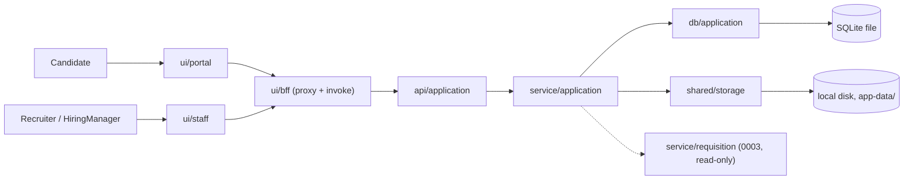
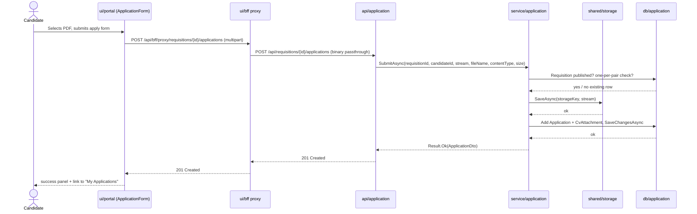
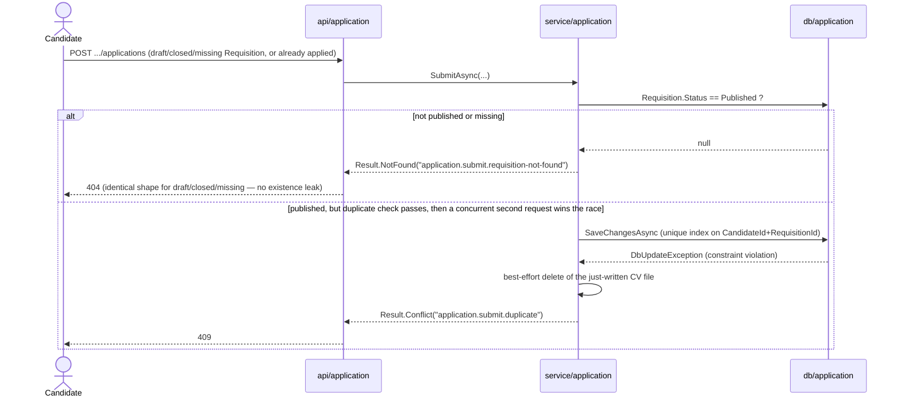
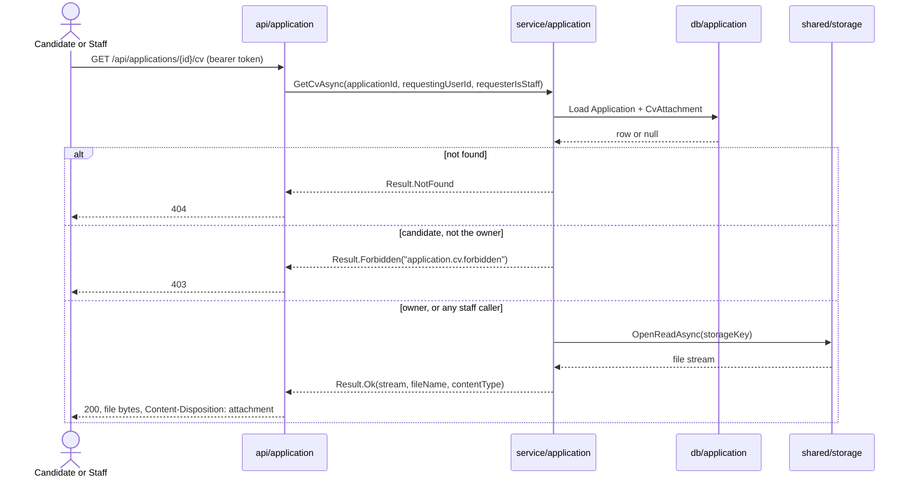
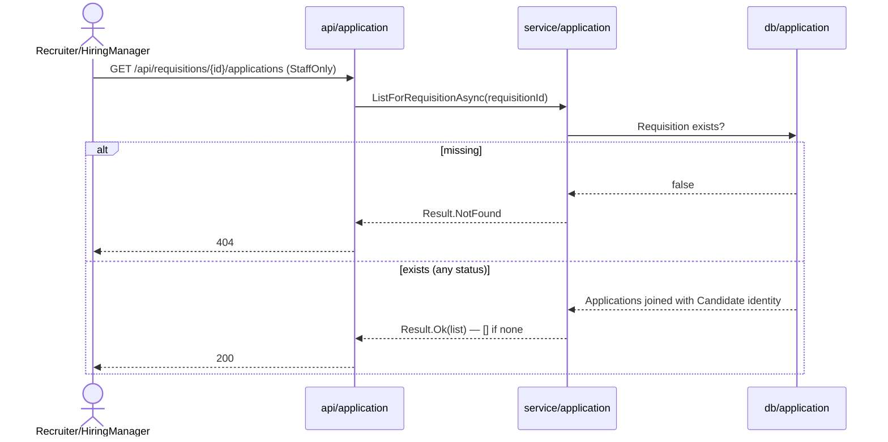

# High-Level Design — 0004 Application Submission and CV Upload

**Spec:** `../spec.md` · **Status:** planned · **Updated:** 2026-08-06

---

## 1. Solution Overview

A Candidate submits an `Application` (a Requisition reference, a Candidate reference, and a
submission timestamp) together with exactly one PDF CV to a `published` Requisition. The CV is
validated (declared content-type, extension, magic bytes, ≤ 5 MB) and written to local disk
under the backend's app-data directory through a new `shared/storage` interface (`IFileStorage`)
*before* the `Application`/`CvAttachment` rows are inserted in a single, short SQLite
transaction — so a storage failure never leaves an orphaned `Application`, and the write lock is
never held for the file I/O (NFR-1, NFR-3). Duplicate submissions are prevented both by an
early service-layer check and, structurally, by a unique index on
`(CandidateId, RequisitionId)`, so the race in E-1 resolves as a `409`, not a second row.
Staff get a minimal, read-only per-Requisition list; the Candidate gets a minimal list of their
own submissions. The single most important design decision is where the CV physically lives and
how the rest of the system reaches it: never as a client-controlled path, always as a
server-generated opaque key resolved through `IFileStorage`, so no CV is ever downloadable by
guessing or constructing a URL (NFR-2).

## 2. Context Diagram

## 3. Components

| Component | New/Modified | Responsibility | Key collaborators |
|---|---|---|---|
| `api/application` | New | HTTP boundary: submit, candidate "mine" list, staff per-Requisition list, CV download | `service/application` |
| `service/application` | New | Submission eligibility, one-per-pair rule, CV validation orchestration, CV access authorization | `db/application`, `shared/storage`, `db/requisition` (read-only) |
| `db/application` | New | `Application`/`CvAttachment` entities, EF Core configuration, migration | `service/application` |
| `shared/storage` | New | `IFileStorage` interface + `LocalDiskFileStorage` implementation | `service/application` |
| `ui/bff` | Modified | Generalise the existing proxy route handler to pass request/response bodies through as binary (`ArrayBuffer`) instead of text, and to forward `Content-Disposition` — required for multipart CV upload and binary CV download to survive the single-proxy convention (FR-16, `0001`) | `ui/portal`, `ui/staff` |
| `ui/portal` | Modified | Apply flow (CV upload form) reachable from the Requisition detail page; "My Applications" list | `ui/bff` |
| `ui/staff` | Modified | Per-Requisition Applications list (candidate identity, submitted date, CV link) | `ui/bff` |

## 4. Key Flows

### 4.1 Candidate submits an Application with a valid CV *(AC-1, FR-1, FR-7, FR-13, NFR-1, NFR-3)*

### 4.2 Failure — Requisition not published, or a same-Candidate race *(AC-5, AC-6, AC-7, AC-8, E-1, E-2)*

### 4.3 Candidate and Staff CV download, with the ownership boundary *(AC-14, AC-15, AC-20, AC-21, NFR-2)*

### 4.4 Staff lists Applications for a Requisition *(AC-16, AC-17, AC-18, AC-19)*

## 5. Design Decisions

| # | Decision | Alternatives considered | Rationale |
|---|---|---|---|
| D-1 | CV persists to local disk under the backend's app-data directory, behind `IFileStorage` (`shared/storage`) | SQLite BLOB column; cloud/object storage | Settled by Clarification C-1; matches the project's "defer infra, keep an interface" pattern already used for auth/storage in `architecture.md` |
| D-2 | Route shape: `POST`/`GET /api/requisitions/{id}/applications` for submission and staff listing (nested, matches the Requisition-scoped operation); `GET /api/applications/mine` and `GET /api/applications/{id}/cv` top-level (candidate-scoped / shared, not Requisition-scoped) | A single flat `/api/applications` resource for everything, with `requisitionId` in the POST body | Nesting under the Requisition mirrors `0003`'s `/api/requisitions/{id}/publish` shape for Requisition-scoped writes and reads; the candidate's own list and CV download are not naturally scoped to one Requisition, so they stay top-level |
| D-3 | File-type and file-size validation failures both map to `400` via `Result.Validation`, not `413`/`415` | Returning `413 Payload Too Large` for oversized files and `415 Unsupported Media Type` for wrong type (both explicitly allowed by AC-3/AC-4) | The project's `Result` → HTTP mapping (`AuthEndpoints.ToProblemResult()`) has exactly one status per `ResultStatus`; adding two new statuses for a single spec's two edge cases would fork the envelope this project has kept uniform since `0001`. `400` with a distinguishing `code` (`application.submit.invalid-file-type` / `application.submit.file-too-large`) keeps one mapping |
| D-4 | Generalise `ui/bff`'s catch-all proxy route (`route.ts`) to read/write request and response bodies as `ArrayBuffer` instead of `text()`, and to forward `Content-Disposition` | A second, upload-specific proxy route; letting the browser call the backend origin directly for this one endpoint | `text()` UTF-8-decodes arbitrary bytes, corrupting a binary PDF on the way through in either direction. A second proxy route would violate FR-16 (`0001`) — "a single shared server-side invoke function is the only place... a backend call is constructed" — and the direct-to-backend alternative is structurally forbidden (Layering Rule 1). `ArrayBuffer` passthrough is a strict generalisation: JSON bodies round-trip through it unchanged, so no existing caller of the proxy is affected |
| D-5 | The one-Application-per-Candidate-per-Requisition rule (FR-5) is enforced by a unique database index on `(CandidateId, RequisitionId)`, not only by a pre-insert existence check | Application-level check only, relying on request serialisation | Spec Edge Case E-1 explicitly requires the race to resolve structurally, not by check-then-act timing; mirrors `0003`'s general preference for structural invariants (e.g. `Stage.RequisitionId` immutability) over runtime-only guards |
| D-6 | CV content is validated by declared content-type, filename extension, and a magic-byte check (`%PDF-`) before any disk write; no antivirus/malware scan | Extension/content-type only (weaker); a full malware scan (out of scope per spec Non-Goals, `project.md` accepted risk) | Satisfies Clarification C-5 and Assumption A-8 without expanding scope into the explicitly excluded scanning capability |
| D-7 | The CV is written to disk *before* the `Application`/`CvAttachment` rows are inserted; a later `SaveChangesAsync` failure triggers a best-effort delete of the just-written file | Insert the DB rows first, then write the file | NFR-1 requires "an Application never exists without a valid, persisted CV" — writing the file first makes that true by construction. The reverse order would risk exactly the orphan NFR-1 forbids if the file write failed after the row existed |

## 6. Data Model Impact

- New entities: `Application`, `CvAttachment`.
- Modified entities: none. `Requisition` and `AspNetUsers` (Candidate identity) are referenced
  by foreign key only, unchanged.
- Migrations required: yes, one migration (`AddApplicationsAndCvAttachments`), pure table
  creation, no backfill.

## 7. Non-Functional Approach

| NFR | How the design satisfies it |
|---|---|
| NFR-1 (Application never exists without a valid, persisted CV) | Validation (type/size/magic-byte) happens entirely before any disk write; the disk write happens before the DB insert (D-7); a DB failure after a successful disk write triggers a best-effort file delete, not a row without a file |
| NFR-2 (CV reachable only by authorized identity, never by a guessable id alone) | `GetCvAsync` always re-checks `CandidateId == requestingUserId` (candidate) or role membership (staff) server-side on every call; the storage key is server-generated and never exposed to or accepted from the client — only the `Application` GUID is (D-1, coding-standards "uploaded files never served from a path the client controls") |
| NFR-3 (SQLite write lock held only for the row insert) | `IFileStorage.SaveAsync` completes fully before `_dbContext.SaveChangesAsync` is called; no explicit transaction wraps both — the only write-locking operation is the single `SaveChangesAsync` call inserting `Application` + `CvAttachment` |

## 8. Security & Authorization

- **Who can do what:** `Candidate` role — submit an Application to a `published` Requisition,
  list their own Applications, download their own CVs. `Recruiter`/`HiringManager` — list
  Applications for any Requisition, download any Application's CV. No role may act on another
  Candidate's data (FR-12).
- **Enforcement point:** ASP.NET Core authorization policies (`CandidateOnly`, `StaffOnly`,
  established `0002`) gate every endpoint at the `api/application` boundary; ownership
  (Candidate-owns-this-Application) is re-checked inside `service/application` on every CV
  access, never inferred from the route alone (mirrors `coding-standards.md`'s "ownership is
  checked server-side... never inferred from the request").
- **Data exposure:** Staff-facing responses include the applying Candidate's identity
  (first/last name, email) — necessary for FR-10, no broader PII than that. CV file bytes are
  never embedded in a JSON response; download is a dedicated, authorization-checked endpoint.

## 9. Risks & Mitigations

| # | Risk | Likelihood | Impact | Mitigation |
|---|---|---|---|---|
| R-1 | `ui/bff`'s proxy generalisation (D-4) is a change to code every existing feature already depends on | Low | High (a regression here breaks `0001`–`0003`'s flows too) | The change is additive/backward-compatible by construction (`ArrayBuffer` round-trips JSON unchanged); CP-3 includes running the full existing frontend test suite, not just new tests, before the checkpoint is considered done |
| R-2 | Orphaned CV files accumulate on disk when a DB insert fails after a successful file write (best-effort delete may itself fail, e.g. concurrent process holding the file) | Low | Low (disk space only; no data-integrity or security exposure — an orphaned file is never referenced by any `CvAttachment` row, so it is never reachable through the API) | Accepted risk, not mitigated further in this spec — a future storage-hygiene spec could add a sweep job; NFR-1 only requires no *Application* exists without a CV, not the reverse |
| R-3 | Local disk storage does not survive a redeploy to a different machine/container without a persistent volume | Medium | High (CV files silently disappear) | Explicitly named in Clarification C-1/D-1 as an accepted trade-off deferred behind `IFileStorage`; out of scope to solve here — infra/hosting is still `TBD` project-wide |

## 10. Rollout Considerations

- Migration order: `AddApplicationsAndCvAttachments` is additive-only (two new tables, no
  altered columns) — reversible by dropping both tables in FK-safe order (`CvAttachments` then
  `Applications`), matching `0003`'s rollback pattern.
- No feature flag — the endpoints and UI ship together in one checkpointed rollout; there is no
  existing Application data to migrate.
- Backward compatibility: `ui/bff`'s proxy generalisation (D-4) does not change its external
  contract for any existing caller; every current JSON request/response continues to work
  unchanged.

## Related Specs

| Spec | Tier | Why loaded |
|---|---|---|
| `0003` (Requisition Management) | 1 | Owns `Requisition`; reused its `published`-only visibility gate and byte-identical 404 pattern (`GetPublicByIdAsync`) for FR-4. Reused its endpoint-wiring style (`MapGroup`, `Result.ToProblemResult()`), `IConfiguration`-with-fallback pattern, and pagination/route-nesting precedent for D-2. |
| `0002` (User Authentication and Refresh Token Flow) | 1 | Owns `CandidateOnly`/`StaffOnly` policies, JWT claims shape, and RFC 7807 ProblemDetails convention this spec's authorization and error handling consume unchanged. |
| `0001` (Project Scaffolding and Walking Skeleton) | 1 | Owns the `ui/bff` proxy route and shared invoke function this spec extends (D-4) rather than bypasses, and the `ui/portal`/`ui/staff` route-group split this spec's new pages follow. |
