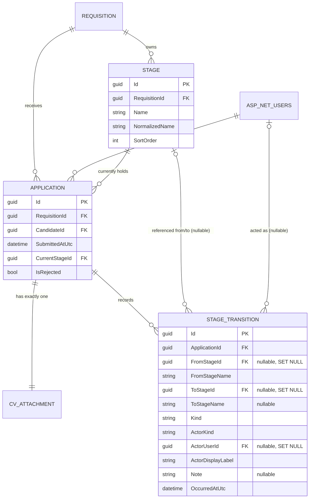

# Data Model — 0005 Pipeline Progression

**Spec:** `../spec.md` · **Updated:** 2026-08-06

> **Model inheritance.** Read `plan/erd.md` of `0003`, `0004`, `0002` first. `0003` established
> `Requisitions`/`Stages` (PascalCase tables, `TEXT`-typed `Guid` PKs, per-entity
> `IEntityTypeConfiguration<T>`); `0004` established `Applications`/`CvAttachments` and the
> "FK required at construction, `ON DELETE CASCADE` even though dormant" pattern; `0002`
> established the `NormalizedEmail`/`NormalizedName` case-insensitive-uniqueness pattern this
> spec reuses for Stage names (HLD D-2).

---

## 1. Diagram



`Requisitions`, `AspNetUsers`, and `CvAttachments` are shown only as neighbours — `CvAttachment`
is unchanged by this spec.

## 2. Delta Summary

| Change | Entity | Detail |
|---|---|---|
| New table | `StageTransitions` | Append-only audit of every move and rejection (FR-12, FR-14); actor modelled as kind + nullable user ref + stored label (FR-13); `FromStageName`/`ToStageName` snapshotted at write time so history survives a later rename or (unoccupied) delete of the referenced Stage (HLD D-1) |
| Altered table | `Stages` | Adds `SortOrder` (int, ordering — FR-3) and `NormalizedName` (uppercase, unique per Requisition — FR-24, HLD D-2). Table is empty in every real deployment (`0003` shipped no Stage-writing code path), so both adds are cheap, non-rebuilding `ALTER TABLE ADD COLUMN`s |
| Altered table | `Applications` | Adds `CurrentStageId` (Guid, FK → `Stages.Id`, `NOT NULL` after backfill, EF concurrency token — FR-7, FR-22) and `IsRejected` (bool, `NOT NULL DEFAULT 0`, EF concurrency token — FR-10, FR-11). Requires a backfill against pre-existing rows (FR-25) |
| Unchanged (referenced, not modified) | `Requisitions` | Its `Id`/`Status` are read by `service/pipeline`'s closed-Requisition guard (FR-21); no column added |
| Unchanged (referenced, not modified) | `AspNetUsers` | `StageTransitions.ActorUserId` FKs to it; no column added |
| Unchanged (not modified) | `CvAttachments` | Not touched by this spec |

## 3. Table Definitions

### 3.1 `Stages` *(altered)*

| Column | Change | Type | Null | Default | Notes |
|---|---|---|---|---|---|
| `SortOrder` | Added | INTEGER | No | `0` | 0-based position within the owning Requisition's pipeline (FR-3). Added/removed stages keep this contiguous (`0..N-1`) — see LLD §3.1 for the shift/compact rules |
| `NormalizedName` | Added | TEXT (max 200) | No | `''` | `Name.ToUpperInvariant()`, recomputed on every rename — mirrors `AspNetRoles.NormalizedName` (`0002`) |

**Indexes**

| Name | Columns | Type | Rationale |
|---|---|---|---|
| `IX_Stages_RequisitionId` | `RequisitionId` | Non-unique | Unchanged from `0003` |
| `IX_Stages_RequisitionId_NormalizedName` | `(RequisitionId, NormalizedName)` | Unique | Structural enforcement of FR-24 (name uniqueness per Requisition), case-insensitive per HLD D-2 |

**Constraints.** Existing PK/FK unchanged. New unique index above.

**Retention.** Unchanged from `0003` — no independent delete lifecycle beyond FR-4's
occupied-Stage guard (enforced in `service/pipeline`, backstopped by `Applications.CurrentStageId`'s
`ON DELETE RESTRICT`, §4).

### 3.2 `Applications` *(altered)*

| Column | Change | Type | Null | Default | Notes |
|---|---|---|---|---|---|
| `CurrentStageId` | Added | TEXT (Guid) | No (after backfill) | — | FK → `Stages.Id`, `ON DELETE RESTRICT`. EF Core concurrency token (`.IsConcurrencyToken()`) — the DB-level enforcement of FR-22's optimistic-move check (HLD D-3) |
| `IsRejected` | Added | INTEGER (bool) | No | `0` | EF Core concurrency token — closes the double-reject race FR-11 implies (HLD D-3) |

**Indexes**

| Name | Columns | Type | Rationale |
|---|---|---|---|
| `IX_Applications_CandidateId_RequisitionId` | unchanged | Unique | `0004`, unchanged |
| `IX_Applications_RequisitionId` | unchanged | Non-unique | `0004`, unchanged |
| `IX_Applications_RequisitionId_CurrentStageId` | `(RequisitionId, CurrentStageId)` | Non-unique | The pipeline board (FR-15, NFR-1) filters by `RequisitionId` then groups by `CurrentStageId`; also serves FR-4's occupied-Stage check (`WHERE CurrentStageId = ?`) via leftmost-prefix-free scan on the trailing column, acceptable given ≤500 rows per Requisition (NFR-1) |

**Constraints.** FK `CurrentStageId → Stages.Id`, `NOT NULL`, `ON DELETE RESTRICT` — a Stage
that is any Application's current Stage can never be deleted, the DB-level backstop for the
`service/pipeline` guard that already enforces FR-4 at the application layer.

**Retention.** Unchanged from `0004`.

### 3.3 `StageTransitions` *(new)*

| Column | Type | Null | Default | Notes |
|---|---|---|---|---|
| `Id` | TEXT (Guid) | No | | PK |
| `ApplicationId` | TEXT (Guid) | No | | FK → `Applications.Id`, `ON DELETE CASCADE` — dormant, mirrors `CvAttachments → Applications` (`0004`); no Application-delete endpoint exists |
| `FromStageId` | TEXT (Guid) | Yes | | FK → `Stages.Id`, `ON DELETE SET NULL`. Always populated at write time (every move and every rejection has an originating Stage); nullable only to tolerate a later Stage deletion without losing the row (FR-14, HLD D-1) |
| `FromStageName` | TEXT (max 200) | No | | Snapshot of the originating Stage's `Name` at write time — the durable display value, independent of later renames/deletes |
| `ToStageId` | TEXT (Guid) | Yes | | FK → `Stages.Id`, `ON DELETE SET NULL`. Populated for a move (`Kind = 'Move'`); always `NULL` for a rejection (`Kind = 'Reject'`) |
| `ToStageName` | TEXT (max 200) | Yes | | Snapshot of the destination Stage's `Name` at write time; `NULL` only when `Kind = 'Reject'` |
| `Kind` | TEXT | No | | `'Move'` \| `'Reject'`, `HasConversion<string>()` — mirrors `Requisitions.Status`'s string-stored-enum convention (`0003`). The authoritative discriminator; do not infer from `ToStageId`'s nullability alone (that can also go null via `SET NULL` on a move whose target was later deleted) |
| `ActorKind` | TEXT | No | | `'User'` \| `'System'` (FR-13), `HasConversion<string>()`. This spec's own code paths write only `'User'` |
| `ActorUserId` | TEXT (Guid) | Yes | | FK → `AspNetUsers.Id`, `ON DELETE SET NULL`. Nullable per FR-13's spec-mandated shape; always populated by this spec's own `User`-kind transitions |
| `ActorDisplayLabel` | TEXT (max 200) | No | | e.g. `"Jane Recruiter"`, captured at write time (FR-13) |
| `Note` | TEXT (max 2000) | Yes | | Optional staff-only free-text (FR-23); never surfaced to a Candidate |
| `OccurredAtUtc` | TEXT (DateTime) | No | | Set once, at creation; never updated (FR-14) |

**Indexes**

| Name | Columns | Type | Rationale |
|---|---|---|---|
| `IX_StageTransitions_ApplicationId_OccurredAtUtc` | `(ApplicationId, OccurredAtUtc)` | Non-unique | FR-16's chronological per-Application history query |

**Constraints.** PK on `Id`. FKs as above. No `CHECK` on `Kind`'s two-value domain — enforced by
the C# enum + `service/pipeline`, consistent with `0003`'s precedent for `Requisitions.Status`.

**Retention.** Append-only — no code path in this spec (or any prior spec) updates or deletes a
`StageTransitions` row (FR-14, AC-17). Retained indefinitely.

## 4. Relationships

| From | To | Cardinality | On delete | Notes |
|---|---|---|---|---|
| `Applications` | `Stages` (`CurrentStageId`) | many-to-one | RESTRICT | DB-level backstop for FR-4's occupied-Stage removal guard |
| `StageTransitions` | `Applications` | many-to-one | CASCADE | Dormant — no Application-delete endpoint exists |
| `StageTransitions` | `Stages` (`FromStageId`) | many-to-one, nullable | SET NULL | Preserves the row (and its `FromStageName` snapshot) if the Stage is later deleted |
| `StageTransitions` | `Stages` (`ToStageId`) | many-to-one, nullable | SET NULL | Same, for the destination Stage of a move |
| `StageTransitions` | `AspNetUsers` (`ActorUserId`) | many-to-one, nullable | SET NULL | Preserves the row (and its `ActorDisplayLabel` snapshot) if the user is ever deleted — no such endpoint exists yet |

## 5. Migrations

One migration (`AddPipelineProgression`), ordered and — with the exception of the raw-SQL data
steps, which are inherently one-directional — individually reversible. Unlike `0003`/`0004`'s
pure `CreateTable` migrations, this one alters populated tables and therefore needs hand-adjusted
`Up()`/`Down()` bodies beyond what `dotnet ef migrations add` emits automatically; see LLD §10 and
§12 for the exact sequence `/implement` must produce.

> **As shipped (CP-1) — see LLD §10 and its Deviation Log.** Two changes from the table below:
> (1) the FK on `CurrentStageId` is added via a separate `AddForeignKey` call placed immediately
> after step 11's `AlterColumn`, not declared alongside the nullable `AddColumn` at step 6 —
> interleaving the raw-SQL backfill (steps 9-10) between an `AddForeignKey`/`AlterColumn`
> operation and the point EF's Sqlite generator flushes the table rebuild it requires fails
> outright; (2) step 9's SQL uses a `UNION ALL SELECT` derived table instead of a
> column-aliased `VALUES (...) AS v(Name, SortOrder)` constructor, which this project's SQLite
> version rejects with a syntax error. Both are reflected in the SQL below.

| # | Operation | Reversible | Backfill | Downtime |
|---|---|---|---|---|
| 1 | `AddColumn<int>("SortOrder", "Stages", nullable: false, defaultValue: 0)` | Yes — `DropColumn` | — | None (`Stages` is empty in every real deployment; even if not, a constant-default `NOT NULL` add is a plain `ALTER TABLE ADD COLUMN`, not a rebuild) |
| 2 | `AddColumn<string>("NormalizedName", "Stages", nullable: false, defaultValue: "")` | Yes — `DropColumn` | — | None, same reasoning as #1 |
| 3 | `CreateIndex("IX_Stages_RequisitionId_NormalizedName", "Stages", ["RequisitionId","NormalizedName"], unique: true)` | Yes — `DropIndex` | — | None — `Stages` is empty, no duplicate-violation risk |
| 4 | `CreateTable("StageTransitions")` with all columns/FKs/`Kind`/`ActorKind` conversions from §3.3 | Yes — `DropTable` | — | None — new, empty table |
| 5 | `CreateIndex("IX_StageTransitions_ApplicationId_OccurredAtUtc", ...)` | Yes — `DropIndex` | — | None |
| 6 | `AddColumn<Guid>("CurrentStageId", "Applications", nullable: true)` — **no FK yet** (added at step 11a, below) | Yes — `DropColumn` | — | None — a plain `ALTER TABLE ADD COLUMN`, no rebuild, since no FK/rebuild-triggering constraint is attached at this point |
| 7 | `AddColumn<bool>("IsRejected", "Applications", nullable: false, defaultValue: false)` | Yes — `DropColumn` | — | None, same reasoning as #6 |
| 8 | `CreateIndex("IX_Applications_RequisitionId_CurrentStageId", "Applications", ["RequisitionId","CurrentStageId"])`, `CreateIndex("IX_Applications_CurrentStageId", ...)` | Yes — `DropIndex` | — | None — plain `CREATE INDEX`, no rebuild |
| 9 | **Data backfill — raw SQL**, run after #1–#8: seed the default 4-Stage set for every Requisition that currently has zero Stages (see exact SQL below) | No (data operation) | Yes — see below | None — single-pass `INSERT ... SELECT`, ≤ hundreds of rows |
| 10 | **Data backfill — raw SQL**: set `Applications.CurrentStageId` to each Application's Requisition's lowest-`SortOrder` Stage, and `IsRejected = 0`, for every row where `CurrentStageId IS NULL` (see exact SQL below) | No (data operation) | Yes | None — single-pass `UPDATE`, low-hundreds-to-thousands of rows |
| 11 | `AlterColumn<Guid>("CurrentStageId", "Applications", nullable: false)`, immediately followed by `AddForeignKey("CurrentStageId" → "Stages"."Id", RESTRICT)` — back-to-back, nothing else in `Up()` after them | Yes — `AlterColumn` back to nullable / `DropForeignKey` | — | Brief — SQLite cannot add an FK constraint or tighten nullability via plain `ALTER TABLE`; EF Core's Sqlite generator performs its standard rebuild (create-copy-drop-rename) for these two operations. `Applications` is low-hundreds-to-thousands of rows (`0004` erd.md §6) — sub-second. Both operations land in the same rebuild window since nothing separates them |

**Step 9 SQL** (GUIDs generated in SQLite via `randomblob`/`hex`, producing a valid
`8-4-4-4-12` hex string `Guid.Parse` accepts):

```sql
INSERT INTO Stages (Id, RequisitionId, Name, NormalizedName, SortOrder)
SELECT
  lower(hex(randomblob(4)) || '-' || hex(randomblob(2)) || '-' || hex(randomblob(2)) || '-' ||
        hex(randomblob(2)) || '-' || hex(randomblob(6))),
  r.Id,
  v.Name,
  upper(v.Name),
  v.SortOrder
FROM Requisitions r
CROSS JOIN (
  SELECT 'Applied' AS Name, 0 AS SortOrder
  UNION ALL SELECT 'Screening', 1
  UNION ALL SELECT 'Interview', 2
  UNION ALL SELECT 'Offer', 3
) AS v
WHERE NOT EXISTS (SELECT 1 FROM Stages s WHERE s.RequisitionId = r.Id);
```

> **Assumption:** the literal 4-name list here must match `Stage.DefaultStageNames` (LLD §2.1)
> exactly — verified by a dedicated migration test (tasks.md T-06), not by a shared constant
> (raw SQL cannot reference a C# constant).

**Step 10 SQL:**

```sql
UPDATE Applications
SET CurrentStageId = (
      SELECT s.Id FROM Stages s
      WHERE s.RequisitionId = Applications.RequisitionId
      ORDER BY s.SortOrder ASC
      LIMIT 1
    ),
    IsRejected = 0
WHERE CurrentStageId IS NULL;
```

By the time step 10 runs, step 9 has already guaranteed every Requisition has at least one
Stage, so the subquery always resolves (AC-32).

**Rollback plan.** `dotnet ef database update AddApplicationsAndCvAttachments --project src/Db`
reverses all 11 steps in one call (`Down()` drops `IX_Applications_RequisitionId_CurrentStageId`,
`AlterColumn` back to nullable, drops `IsRejected`/`CurrentStageId`, drops `StageTransitions` and
its index, drops `NormalizedName`/`SortOrder` from `Stages`). The two data-backfill steps (9, 10)
are not reversed by `Down()` — reversing them means deleting the newly-seeded default Stages and
nulling `CurrentStageId` back out, which is exactly what dropping the columns/table already
accomplishes; no separate `Down()` SQL is needed since the columns/rows cease to exist.

## 6. Data Volume & Growth

| Table | Initial rows (post-backfill) | Growth | Notes affecting indexing |
|---|---|---|---|
| `Stages` | 4 × (existing Requisition count) | ~4–8 per Requisition, low write volume (Recruiter-edited) | Trivially small per Requisition; `IX_Stages_RequisitionId_NormalizedName` is sufficient |
| `StageTransitions` | 0 (no backfill transitions — FR-25) | Unbounded, grows with every move/reject; likely the fastest-growing table in the project (mirrors the erd.md template's own note about a `stage_history`-shaped table) | `IX_StageTransitions_ApplicationId_OccurredAtUtc` keeps FR-16 cheap; revisit partitioning only far beyond this project's projected scale |

## 7. Seed / Reference Data

| Table | Rows | Source |
|---|---|---|
| `Stages` | 4 default rows per **existing** Requisition, via migration backfill (FR-25) | Migration (§5, step 9) |
| `Stages` | 4 default rows per **newly created** Requisition, going forward | `RequisitionService.CreateAsync` (FR-5), not the migration |

## 8. PII & Retention

| Column | Classification | Retention | Deletion path |
|---|---|---|---|
| `StageTransitions.ActorDisplayLabel` | PII (a staff member's name) | Indefinite (no delete path — FR-14 append-only) | N/A — inherits whatever a future GDPR-erasure spec adds to `AspNetUsers`; the snapshot would need explicit handling then, same open question `0004`'s erd.md already left for `AspNetUsers` |
| `StageTransitions.Note` | Potential PII (free text; a Recruiter could write anything, including a candidate's name) | Indefinite | N/A |
| `Stages.Name` / `StageTransitions.FromStageName`/`ToStageName` | Not PII — pipeline-process wording | Indefinite | N/A |

## Related Specs

| Spec | Tier | Why loaded |
|---|---|---|
| `0003` (Requisition Management) | 1 | `Stages`/`Requisitions` table shapes this spec alters; reused the `TEXT`-Guid-PK, per-entity `IEntityTypeConfiguration<T>`, string-stored-enum (`Status`/`Kind`) conventions. |
| `0004` (Application Submission and CV Upload) | 1 | `Applications` table shape this spec alters; reused the "FK required, `ON DELETE CASCADE` even though dormant" pattern for `StageTransitions → Applications`, and the low-hundreds-to-thousands row-count estimate for downtime sizing. |
| `0002` (User Authentication and Refresh Token Flow) | 1 | `AspNetUsers` is the table `StageTransitions.ActorUserId` FKs to; reused the `NormalizedEmail`/`NormalizedName` case-insensitive-uniqueness pattern for Stage names (HLD D-2). |
