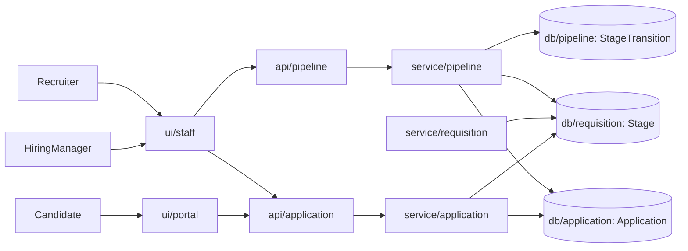
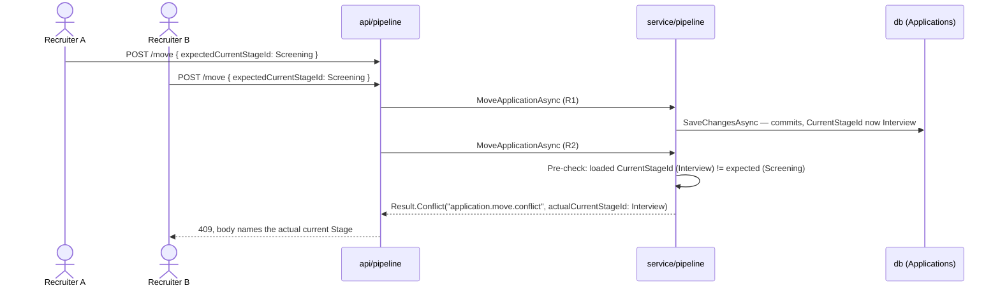

# High-Level Design — 0005 Pipeline Progression

**Spec:** `../spec.md` · **Status:** planned · **Updated:** 2026-08-06

---

## 1. Solution Overview

`Stage` becomes a real, ordered, Recruiter-editable pipeline per Requisition, and `Application`
gains a durable current-Stage reference plus a terminal rejected flag — both structural database
properties, not conventions (G-1). Every move and rejection is written as an immutable
`StageTransition` row whose actor is captured as a `(kind, nullable user id, stored display
label)` triple — a forward-compatible shape (FR-13) that also becomes the technique used
throughout the new table to survive a Stage being renamed or (once unoccupied) deleted:
`StageTransition` snapshots `FromStageName`/`ToStageName` at write time rather than trusting a
live join back to `Stages`, so history is genuinely append-only (FR-14) even as the pipeline it
once described continues to change. The single most important design decision is that **this is
the project's first migration that both alters populated tables and backfills data**: `Stages`
gets `SortOrder`/`NormalizedName` added as a cheap, non-rebuilding column add (the table is empty
in every real deployment — `0003` shipped no Stage-writing code path), while `Applications` gets
`CurrentStageId` (with an FK) added nullable first, backfilled by raw SQL, then tightened to
`NOT NULL` — the safe three-step sequence the project's own `erd.md` template already prescribes,
chosen over a single-rebuild "sentinel default" trick because the latter's correctness would
depend on SQLite's `foreign_keys` pragma state at migration time (currently off — see LLD §12).

## 2. Context Diagram



## 3. Components

| Component | New/Modified | Responsibility | Key collaborators |
|---|---|---|---|
| `api/pipeline` | New | Stage CRUD/reorder/remove, move/reject, staff pipeline board, transition-history endpoints | `service/pipeline` |
| `service/pipeline` | New | Stage config rules (uniqueness, occupied-removal guard), move/reject transition logic, optimistic concurrency (FR-22), closed-Requisition guard (FR-21), transaction boundary | `db/pipeline`, `db/requisition` (`Stage`), `db/application` (`Application`) |
| `db/pipeline` | New | `StageTransition` entity + EF Core configuration; owns the migration alongside `db/requisition`/`db/application`'s deltas | `db/requisition`, `db/application` |
| `service/requisition` | Modified | `CreateAsync` now also seeds the default 4-Stage set (FR-5) in the same `SaveChangesAsync` | `db/requisition` |
| `db/requisition` | Modified | `Stage` gains `SortOrder`, `NormalizedName`; `Stage.Create` signature gains a `sortOrder` parameter | — |
| `api/application` | Modified | Candidate own-list response gains `currentStageName`/`isRejected` (FR-17) | `service/application` |
| `service/application` | Modified | `SubmitAsync` now resolves and assigns the Requisition's first Stage (FR-7) before persisting | `db/requisition` (`Stage`) |
| `db/application` | Modified | `Application` gains `CurrentStageId` (FK, concurrency token) and `IsRejected` (concurrency token) | `db/requisition` |
| `ui/staff` | Modified | Adds Stage-configuration screen, pipeline board, move/reject controls, transition-history view | `api/pipeline` |
| `ui/portal` | Modified | "My Applications" renders real status (Stage name or rejected indicator) | `api/application` |

## 4. Key Flows

### 4.1 Recruiter moves an Application *(AC-11, AC-12, AC-16)*

```mermaid
sequenceDiagram
  actor R as Recruiter
  participant UI as ui/staff (PipelineBoard)
  participant API as api/pipeline
  participant SVC as service/pipeline
  participant DB as db (Applications, StageTransitions)

  R->>UI: Select "Move to Interview" on an Application card
  UI->>API: POST /api/applications/{id}/move { targetStageId, expectedCurrentStageId, note? }
  API->>SVC: MoveApplicationAsync(id, dto, actingUserId)
  SVC->>DB: Load Application (tracked) + Requisition status
  SVC->>SVC: Guard: not rejected, Requisition not closed, target Stage belongs to same Requisition
  SVC->>SVC: application.MoveToStage(targetStageId); build StageTransition (snapshot names, User actor)
  SVC->>DB: SaveChangesAsync (concurrency-token UPDATE on CurrentStageId/IsRejected + INSERT StageTransition)
  DB-->>SVC: ok
  SVC-->>API: Result.Ok(ApplicationTransitionDto)
  API-->>UI: 200
  UI-->>R: Board updates, card moves to "Interview" column
```

### 4.2 Stale move — concurrent conflict *(AC-29, E-2)*



Even when the pre-check race-condition window is missed (both readers see `Screening` before
either writes), `CurrentStageId`/`IsRejected` are EF Core concurrency tokens — the second
`SaveChangesAsync` throws `DbUpdateConcurrencyException`, caught and mapped to the same 409.

## 5. Design Decisions

| # | Decision | Alternatives considered | Rationale |
|---|---|---|---|
| D-1 | `StageTransition` snapshots `FromStageName`/`ToStageName` at write time; `FromStageId`/`ToStageId` are nullable FKs with `ON DELETE SET NULL` | (a) Hard `RESTRICT` FKs — makes any historically-referenced Stage permanently undeletable, contradicting FR-4's "no Applications" (current-occupancy-only) condition; (b) live join to `Stages.Name` on every history read — breaks FR-14 the moment a Stage is renamed or deleted | Mirrors FR-13/C-2's own rationale for `ActorDisplayLabel` (store a durable label, don't trust a live join) — same technique, same table, same justification |
| D-2 | Stage name uniqueness enforced via a `NormalizedName` column (upper-invariant) + unique `(RequisitionId, NormalizedName)` index, not a raw case-sensitive unique index on `Name` | Case-sensitive unique index; service-layer-only check with no DB backstop | Reuses the exact `NormalizedEmail`/`NormalizedName` pattern `0002`'s `AspNetUsers`/`AspNetRoles` already established — case-insensitive uniqueness without inventing a new convention |
| D-3 | `Application.CurrentStageId` and `Application.IsRejected` are both EF Core concurrency tokens (`.IsConcurrencyToken()`), not a dedicated `RowVersion`/`byte[]` column | A dedicated `RowVersion` column (broader, but this project has never used one — `0003`'s Assumption A-4 explicitly chose "no RowVersion, last write wins" for Requisition); relying on the FR-22 pre-check alone (leaves a true TOCTOU race open) | Scopes optimistic concurrency to exactly the two columns whose staleness matters (FR-22's literal ask), catches the reject-double-submission race FR-11 implies but never names, and needs no new column shape |
| D-4 | Migration backfills `Applications.CurrentStageId` via nullable-add → raw-SQL backfill → `AlterColumn` NOT NULL (three ops, up to two SQLite table rebuilds), not a single-rebuild "NOT NULL with sentinel default" | Sentinel-default single rebuild — cheaper, but the sentinel value (e.g. `Guid.Empty`) never matches a real `Stages.Id`; if `PRAGMA foreign_keys` is ever turned on before this ships (`SqlitePragmaConnectionInterceptor` doesn't set it today) the rebuild's own copy step would fail outright | The project's own `erd.md` template already prescribes exactly this three-step sequence; two rebuilds on a low-hundreds-row table is a one-time, sub-second migration cost, not a runtime NFR |
| D-5 | `service/requisition`'s `CreateAsync` seeds the default Stage set directly (no new `IPipelineService` dependency) | Have `RequisitionService` call into `service/pipeline` | `Stage` remains owned by `db/requisition` (unchanged from `0003`); `service/requisition` already constructs `Stage` indirectly via the `Requisition.Stages` navigation, so no new project reference is needed — introducing a `service/requisition` → `service/pipeline` dependency would be a real, avoidable new coupling for no benefit |
| D-6 | Endpoint URLs: `POST /api/applications/{id}/move` / `/reject` (top-level, not nested under `/requisitions/{id}`) | Nest under `/api/requisitions/{id}/applications/{appId}/move` | `0004` already addresses an `Application` top-level by id (`/api/applications/{id}/cv`, `/api/applications/mine`) — reuses that established addressing scheme rather than introducing a second one |
| D-7 | Move/Reject 409 conflict responses need an extra `actualCurrentStageId`/`actualCurrentStageName` field beyond `code`/`errors`; `Result`/`ToProblemResult()` gain an optional `Extensions` dictionary | Hand-build a bespoke `ProblemDetails` at the endpoint layer, bypassing `ToProblemResult()` for this one case | `0003` set the precedent of *extending* `Result` (its 3-arg `Validation` overload) rather than duplicating ProblemDetails-mapping logic at the endpoint layer when the existing shape fell short — same move, same file |

## 6. Data Model Impact

- New entities: `StageTransition`.
- Modified entities: `Stage` (adds `SortOrder`, `NormalizedName`), `Application` (adds
  `CurrentStageId`, `IsRejected`).
- Migrations required: yes, with backfill — see `erd.md` §5 for the full ordered sequence.

## 7. Non-Functional Approach

| NFR | How the design satisfies it |
|---|---|
| NFR-1 (pipeline board renders <2s p95 at ≤500 Applications, no pagination) | `GetPipelineBoardAsync` issues exactly two `AsNoTracking()` queries (Stages ordered by `SortOrder`; Applications joined to `AspNetUsers` for one Requisition, indexed by `IX_Applications_RequisitionId_CurrentStageId`), then groups in memory — grouping 500 rows in-process is sub-millisecond; no per-stage round trip |
| NFR-2 (SQLite write-lock scope — transaction open only for the Application/StageTransition writes) | `MoveApplicationAsync`/`RejectApplicationAsync` load their data in the same short-lived `DbContext` scope and call `SaveChangesAsync` once; no external I/O (no file writes, unlike `0004`'s CV path) occurs between load and save, so there is nothing to move out of the transaction window |

## 8. Security & Authorization

- **Who can do what:** `Recruiter` — full write access (Stage config, move, reject).
  `HiringManager` — read-only (pipeline board, transition history), consistent with `0003`'s
  precedent (C-5). `Candidate` — read-only, scoped to their own Application's status via the
  existing `/api/applications/mine` (no new candidate-facing endpoint is introduced).
- **Enforcement point:** `RequireAuthorization(AuthConstants.Policies.RecruiterOnly)` on every
  write endpoint, `StaffOnly` on the board/history reads — both policies already exist
  (`0002`), reused unchanged. No policy work is required.
- **Data exposure:** the staff-visible transition `Note` (FR-23) is never included in any
  Candidate-facing DTO — `CandidateApplicationListItemDto`'s new fields are `currentStageName`/
  `isRejected` only, structurally incapable of carrying a note field.

## 9. Risks & Mitigations

| # | Risk | Likelihood | Impact | Mitigation |
|---|---|---|---|---|
| R-1 | A Recruiter removes every Stage from a Requisition (each individually unoccupied, so FR-4 permits it) before any Candidate applies, leaving zero Stages for FR-7 to assign at submission | Low | Medium — would otherwise leave `SubmitAsync` unable to satisfy G-1's structural guarantee | `SubmitAsync` defensively checks for at least one Stage and returns a `409 application.submit.no-stages-configured` rather than creating a stage-less Application; flagged to the user as a spec gap (final report) since FR-4 does not itself forbid this |
| R-2 | The 4 default-Stage names are a literal string list in three places — `Stage.DefaultStageNames` (C#, used by `RequisitionService`), and the migration's raw SQL data step (which cannot reference C# constants) | Low | Low — a drift here only affects the one-time backfill/seed wording, not runtime behaviour | A dedicated migration test (`AddPipelineProgression_Backfill_MatchesDefaultStageNames`) asserts the migrated database's seeded Stage names equal `Stage.DefaultStageNames`, catching drift at test time |
| R-3 | Two rebuilds of `Applications` during the migration (D-4) run against a live-sized production table one day | Low today, grows over time | Medium | `erd.md` §6 tracks growth; the migration is one-time, and current/projected volumes (low thousands per `0004`'s own estimate) keep the rebuild sub-second — revisit if `Applications` ever reaches six figures |

## 10. Rollout Considerations

- Migration order: `Stage` column adds → `StageTransitions` table create → `Applications`
  column adds (nullable) → data backfill (raw SQL) → `Applications.CurrentStageId` tightened to
  `NOT NULL`. Each step is individually reversible; full detail in `erd.md` §5.
- Feature flag: none — matches every prior spec in this project.
- Backward compatibility: `0003`'s Requisition lifecycle endpoints and `0004`'s submission/CV/
  list endpoints are unchanged in URL, request shape, and status codes; the only response-shape
  change is the additive `currentStageName`/`isRejected` fields on
  `GET /api/applications/mine`, which existing clients ignore harmlessly.

## Related Specs

| Spec | Tier | Why loaded |
|---|---|---|
| `0003` (Requisition Management) | 1 | Owns `Stage`/`Requisition`; read `spec.md` ACs, `plan/api.md`, `plan/erd.md` in full, plus the shipped `RequisitionService.cs`, `RequisitionConfiguration.cs`, `StageConfiguration.cs`, `RequisitionEndpoints.cs`. Reused `RecruiterOnly`/`StaffOnly` policy names, the `MapGroup`/`ToProblemResult()` endpoint pattern, the `Result`-extension precedent (D-7), and the erd.md template's own nullable-add/backfill/tighten migration sequence (D-4). |
| `0004` (Application Submission and CV Upload) | 1 | Owns `Application`/`CvAttachment`; read `spec.md` ACs, `plan/api.md`, `plan/erd.md` in full, plus the shipped `ApplicationService.cs`, `Application.cs`, `ApplicationConfiguration.cs`, `ApplicationEndpoints.cs`. This spec modifies `SubmitAsync` (FR-7) and the candidate list DTO (FR-17) — read to scope that diff precisely. Reused the top-level `/api/applications/{id}/...` addressing scheme (D-6) and the duplicate-submission pre-check + DB-constraint-fallback pattern (reused for the reject/move concurrency guard, D-3). |
| `0002` (User Authentication and Refresh Token Flow) | 1 | Owns `AspNetUsers`/roles/policies this spec's authorization consumes unchanged, and the `NormalizedEmail`/`NormalizedName` pattern reused for Stage name uniqueness (D-2). `AspNetUsers.Id` is the column `StageTransition.ActorUserId` FKs to. |

Tier 0 read in full: `meta/architecture.md`, `meta/tech-stack.md`, `meta/coding-standards.md`,
`index.md`. Considered and skipped: `0001` — its conventions reach this spec unchanged via
`0003`/`0004`, both already at the Tier-1 cap (matches `spec.md`'s own selection).
