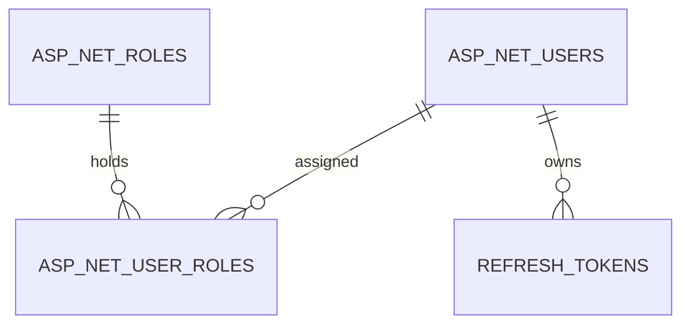

# Data Model — 0007 Seed Sample User Accounts per Role

**Spec:** `../spec.md` · **Updated:** 2026-08-14

> **Model inheritance.** Read `plan/erd.md` of the Tier-1 specs first. Reuse existing entity
> names, key types, audit-column conventions, and naming style. Never redefine an entity that
> already exists — reference it and describe only your delta.

---

## 1. Diagram

Entities this spec touches, plus their immediate neighbours for orientation. Both entities
below already exist (`0002`) — this spec changes their **rows**, not their **schema**.

## 2. Delta Summary

The most important section — what changes relative to the current model in
`meta/architecture.md`. **No schema change of any kind.** This spec is pure seed-data.

| Change | Entity | Detail |
|---|---|---|
| New rows (data only, no column change) | `AspNetUsers` | 3 fixed-Id seeded rows — one Candidate, one Recruiter, one HiringManager (`HasData`) |
| New rows (data only, no column change) | `AspNetUserRoles` | 3 fixed `(UserId, RoleId)` seeded rows, one per seeded user (`HasData`) |
| Unchanged (referenced) | `AspNetRoles` | Read-only here — the 3 existing seeded role rows (`0002`'s `SeedRoles`) are the `RoleId` targets |
| Unchanged (referenced) | `RefreshTokens` | Not touched by this spec; seeded accounts gain rows here only when they actually log in, same as any account |

## 3. Table Definitions

No new or altered tables — both `AspNetUsers` and `AspNetUserRoles` keep the exact column set
`0002`'s `plan/erd.md` §3.1/§3.3 (and the ASP.NET Core Identity defaults) already define. See
§7 below for the row-level values this spec adds instead of a schema definition.

## 4. Relationships

No new or changed relationship. `AspNetUserRoles.UserId → AspNetUsers.Id` (CASCADE) and
`AspNetUserRoles.RoleId → AspNetRoles.Id` (CASCADE) are exactly the relationships `0002`
already established; the seeded rows simply populate them.

## 5. Migrations

Ordered, each individually reversible.

| # | Operation | Reversible | Backfill | Downtime |
|---|---|---|---|---|
| 1 | Add `AuthConstants.SeedAccounts` constants (fixed Ids, emails, pinned password hash) | Yes — code-only, no migration | — | None |
| 2 | Add `AppDbContext.SeedUsers(ModelBuilder)`, invoked from `OnModelCreating` | Yes — code-only, no migration | — | None |
| 3 | `dotnet ef migrations add AddSeedSampleAccounts --project src/Db` | Yes — EF auto-generates `Down()` deleting the 6 rows by PK | — | None |
| 4 | `dotnet ef database update --project src/Db` | Yes — `dotnet ef database update <previous-migration>` | — | None |

**Rollback plan.** Run `dotnet ef database update AddPipelineProgression --project src/Db`
(the migration immediately preceding this one, per `meta/architecture.md`'s Change Log) to
remove the 6 seeded rows. A brand-new database that never applies `AddSeedSampleAccounts`
simply lacks the three sample accounts — no other schema is affected either way.

## 6. Data Volume & Growth

| Table | Initial rows added | Growth | Notes affecting indexing |
|---|---|---|---|
| `AspNetUsers` | +3 (fixed) | None — these rows never grow; only re-created by rolling the migration back and forward | Already indexed on `NormalizedEmail`/`NormalizedUserName` (`0002`); seeded rows use the same indexes, no new index needed |
| `AspNetUserRoles` | +3 (fixed) | None | Composite PK `(UserId, RoleId)` already covers uniqueness |

## 7. Seed / Reference Data

**This is the canonical, single-place listing required by FR-8/AC-9** — a developer looking for
the seeded credentials finds all three emails and the one shared password together here,
without opening migration source.

| Role | Email | Password | Seeded `ApplicationUser.Id` |
|---|---|---|---|
| Candidate | `sample.candidate@d4fape-ats.local` | `Temp@123` | `d6b4122d-6228-4e08-bf29-43c3d5e23b01` |
| Recruiter | `sample.recruiter@d4fape-ats.local` | `Temp@123` | `d6b4122d-6228-4e08-bf29-43c3d5e23b02` |
| HiringManager | `sample.hiringmanager@d4fape-ats.local` | `Temp@123` | `d6b4122d-6228-4e08-bf29-43c3d5e23b03` |

All three accounts share the one password above. Log in via `POST /api/auth/login` (see
`plan/api.md` §3.1 for a worked example). These accounts exist in every environment (no
environment gating, per FR-6/AC-7) and are restored only by rolling the `AddSeedSampleAccounts`
migration back and forward (E-2) — deleting a row locally does not bring it back on its own.

| Table | Rows | Source |
|---|---|---|
| `AspNetUsers` | 3 (table above) | Migration `AddSeedSampleAccounts` (`AppDbContext.SeedUsers`) |
| `AspNetUserRoles` | 3 (one per seeded user, role matching the table above) | Migration `AddSeedSampleAccounts` (`AppDbContext.SeedUsers`) |

## 8. PII & Retention

| Column | Classification | Retention | Deletion path |
|---|---|---|---|
| `AspNetUsers.Email` (seeded rows only) | Synthetic — not a real person's data (`.local` TLD, `sample.` prefix by design, C-1) | Indefinite — fixture data, not subject to the real-account retention policy in `0002`'s `plan/erd.md` §8 | Roll the `AddSeedSampleAccounts` migration back |
| `AspNetUsers.FirstName` / `LastName` (seeded rows only) | Synthetic placeholder (`"Sample"` / role name, A-3) — not PII | Indefinite | Roll the `AddSeedSampleAccounts` migration back |
| `AspNetUsers.PasswordHash` (seeded rows only) | Sensitive credential material (same classification as `0002`'s real accounts), but protects only an intentionally public sample password | Indefinite | Roll the `AddSeedSampleAccounts` migration back |

## Related Specs

| Spec | Tier | Why loaded |
|---|---|---|
| `0002` (User Authentication and Refresh Token Flow) | 1 | Owns `AspNetUsers`/`AspNetRoles`/`AspNetUserRoles`/`RefreshTokens`; this spec adds rows to the first two, referencing the third, introducing zero schema change. |
