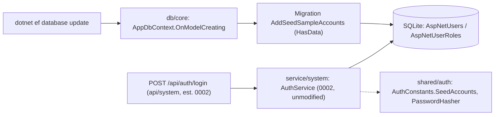
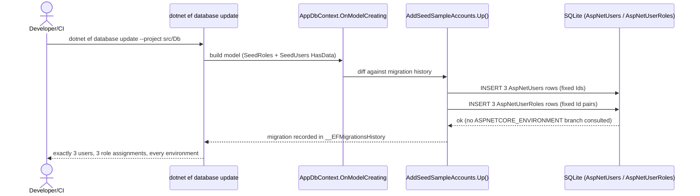
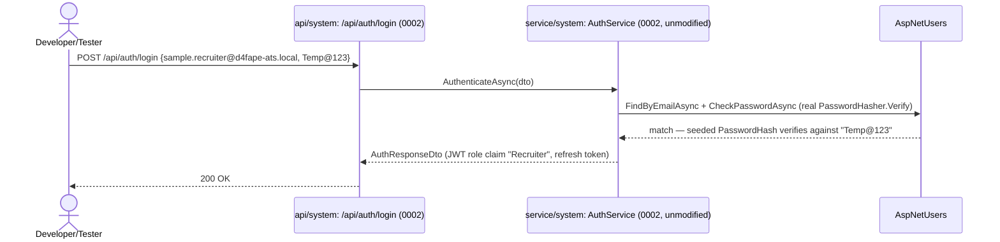
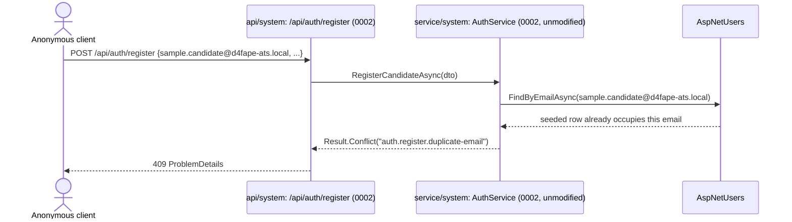

# High-Level Design — 0007 Seed Sample User Accounts per Role

**Spec:** `../spec.md` · **Status:** planned · **Updated:** 2026-08-14

The *what and why* of the design. Someone should be able to read this alone and understand
the shape of the solution and the reasoning behind it, without reading the LLD.

---

## 1. Solution Overview

Three fixed `ApplicationUser` rows — one Candidate, one Recruiter, one HiringManager — are added
to the database the same way the three roles themselves already are: as EF Core `HasData` rows
baked into a migration, inserted by a new `AppDbContext.SeedUsers` method that sits directly
beside the existing `SeedRoles` method. The single most important design decision is how the
password hash gets into that `HasData` call: migrations run inside `OnModelCreating`/`Up()`, with
no dependency injection and no `UserManager`, so the real ASP.NET Core Identity `PasswordHasher`
cannot be invoked at migration-apply time. Instead it is invoked exactly once, at
implementation time, and its output is hardcoded as a constant — the same treatment `SeedRoles`
already gives `ConcurrencyStamp`. Nothing about login, JWT issuance, or role-policy enforcement
changes; the three accounts are ordinary rows that flow through the existing `POST /api/auth/login`
path built by `0002` unmodified.

## 2. Context Diagram

## 3. Components

| Component | New/Modified | Responsibility | Key collaborators |
|---|---|---|---|
| `db/core` | Modified | New migration `AddSeedSampleAccounts`; `AppDbContext.SeedUsers` adds three `ApplicationUser` `HasData` rows and three `AspNetUserRoles` `HasData` rows | `shared/auth` |
| `shared/auth` | Modified | New `AuthConstants.SeedAccounts` nested class: fixed seeded-user GUIDs, seeded emails, the shared password's pinned `PasswordHasher` output | `db/core` |

## 4. Key Flows

### 4.1 Fresh database migration seeds the three accounts *(AC-1, AC-6, AC-7, AC-8, NFR-1)*

### 4.2 Seeded credential logs in like any other account *(AC-3, AC-4, AC-5)*

### 4.3 Duplicate registration against a seeded email *(E-1, failure flow)*

## 5. Design Decisions

| # | Decision | Alternatives considered | Rationale |
|---|---|---|---|
| D-1 | Seed via a sibling `AppDbContext.SeedUsers` method extending the exact `HasData` pattern `SeedRoles` already uses, called from the same `OnModelCreating` | Idempotent runtime/startup seeder (self-heals a deleted row on every boot) | Clarification C-4 settled this; migration-only matches existing precedent and adds no new runtime code path. Logged because it is the central lever of the whole design. |
| D-2 | Compute the seeded `PasswordHash` once via a real `PasswordHasher<ApplicationUser>` invocation at implementation time, then hardcode the resulting string as `AuthConstants.SeedAccounts.SharedPasswordHash` | (a) a custom/simplified hash routine invoked inline; (b) leaving the field null and requiring a first-login password-set step | (a) would not satisfy AC-2's "matches the same ASP.NET Core Identity hash format" — only the real hasher produces that format. (b) contradicts FR-5 (seeded accounts must log in immediately). `HasData` has no DI/UserManager access at migration-apply time, so "once, pinned" is the only way to use the real hasher at all. |
| D-3 | Fixed literal GUIDs for the three seeded `ApplicationUser.Id` values, extending the same literal-GUID convention `AuthConstants.Roles.*RoleId` already established | Random `Guid.NewGuid()` at migration-generation time | `HasData` values must be literal and stable across every fresh migration apply (AC-8); reusing the established fixed-GUID convention keeps the seeding mechanism uniform and immediately recognisable next to `SeedRoles`. |
| D-4 | The new `AuthConstants.SeedAccounts` nested class lives in `shared/auth`, mirroring `AuthConstants.Roles` | A private constant block inside the migration file itself | Keeps one source of truth reachable by both the migration and any test that needs to reference a seeded email/Id, exactly how `AuthConstants.Roles.*RoleId` already serves both `SeedRoles` and policy code. |
| D-5 | FR-8/AC-9 documentation lives in this spec's `plan/erd.md` §7 (Seed / Reference Data), the canonical single table listing all three emails and the shared password together | A new top-level `README.md` or `backend/README.md` | Neither file exists in the project today (would be a second source of truth to keep in sync); spec.md's own wording ("this spec's documentation") already scopes FR-8 to the `docs/specs/0007-seed-sample-accounts/` artifacts. A doc-pointer comment in `AppDbContext.SeedUsers` (LLD §2.2) makes the location discoverable from the code too. |

## 6. Data Model Impact

- New entities: none.
- Modified entities: `ApplicationUser` — three new seeded rows (no schema/column change); `AspNetUserRoles` (`IdentityUserRole<Guid>`) — three new seeded rows (no schema/column change).
- Migrations required: yes, one new migration (`AddSeedSampleAccounts`); no backfill (only `HasData` inserts against a schema that already exists as of `0002`).

## 7. Non-Functional Approach

| NFR | How the design satisfies it |
|---|---|
| NFR-1 (exactly 3 users + 3 role rows, no duplicates/violations on full migration history) | `HasData` rows are recorded once in `__EFMigrationsHistory` per migration; EF Core refuses to re-run an already-applied migration's `Up()`, so re-running the full history never re-inserts these rows (E-4). Verified directly by an integration test that migrates a fresh SQLite file and counts rows. |

## 8. Security & Authorization

- **Who can do what:** identical to any real account. The seeded Candidate token satisfies only `CandidateOnly`; the seeded Recruiter/HiringManager tokens satisfy `RecruiterOnly`/`HiringManagerOnly`/`StaffOnly` exactly as `0002`'s role policies already define. This spec grants no new permission and adds no bypass path.
- **Enforcement point:** unchanged — JWT bearer validation and role-policy checks in `shared/auth`, enforced at `api/*` (established by `0002`, restated in `meta/architecture.md` Cross-Cutting Concerns).
- **Data exposure:** the seeded rows carry synthetic, non-real-person data (`FirstName: "Sample"`, `LastName` matching the role, `.local` emails). `PasswordHash` is never the plaintext password; the plaintext `Temp@123` is intentionally public/documented sample data, not a production secret — see Risks R-3 for the caveat this depends on.

## 9. Risks & Mitigations

| # | Risk | Likelihood | Impact | Mitigation |
|---|---|---|---|---|
| R-1 | The hand-pinned `PasswordHash` constant is mistyped/corrupted when copied from the one-time generation step | Low | Medium — seeded-account login (AC-3/4/5) silently breaks | Dedicated integration tests assert successful login for all three seeded accounts; a bad hash fails CI immediately, not silently in a demo. |
| R-2 | A future spec reuses the `.local` seeded emails as if they were real test fixtures, blurring "sample" vs. "real" data | Low | Low | The `sample.` prefix and `.local` TLD (C-1) are deliberately non-production-looking and greppable. |
| R-3 | The shared password is fixed and committed to source; if this project ever gains a real Production environment, these three accounts remain reachable with a publicly known password (spec Non-Goal: no environment gating) | Medium (no Production environment exists today, per `meta/project.md`) | High if it ever did | Explicitly out of scope here (C-2, spec Non-Goal). Flagged in Rollout Considerations below so the first spec that defines a Production environment revisits this. |

## 10. Rollout Considerations

- Migration order: this migration must apply after `AddAuthenticationAndRefreshTokens` (0002) since it depends on the `AspNetUsers`/`AspNetUserRoles` schema and the seeded role rows already existing. EF Core's migration ordering (timestamp-prefixed filenames) guarantees this automatically — no explicit dependency declaration needed.
- Reversibility: the migration's `Down()` (auto-generated by `dotnet ef migrations add`) deletes the six seeded rows by primary key; rolling back is safe and leaves no orphaned data.
- Feature flag needed: no — spec explicitly rejects environment gating (Non-Goal, C-2).
- Backward compatibility: fully additive; no existing endpoint, DTO, or migration changes shape. Any existing test using a real registered account is unaffected.
- **Follow-up flagged for a future spec:** if/when a Production environment is ever defined for this project, R-3 above must be revisited — this spec deliberately does not gate seeding by environment.

## Related Specs

| Spec | Tier | Why loaded |
|---|---|---|
| `0002` (User Authentication and Refresh Token Flow) | 1 | Owns `shared/auth`/`db/core`; defines `ApplicationUser`/`ApplicationRole`/`AuthConstants` and the `SeedRoles` `HasData` pattern this spec extends directly; its `POST /api/auth/login` contract (AC-4, AC-23) is exercised unmodified by AC-3/AC-4/AC-5 here. |

Tier 0 read in full: `meta/architecture.md`, `meta/tech-stack.md`, `meta/coding-standards.md`, `index.md`.
Source read directly: `backend/src/Db/AppDbContext.cs`, `backend/src/Shared/Auth/AuthConstants.cs`,
`backend/src/Shared/Auth/ApplicationUser.cs`, `backend/src/Service/ServiceCollectionExtensions.cs`,
`backend/src/Service/Auth/AuthService.cs`, `backend/src/Db/Migrations/AppDbContextModelSnapshot.cs`,
`backend/tests/Ats.IntegrationTests/CustomWebApplicationFactory.cs`,
`backend/tests/Ats.IntegrationTests/Pipeline/PipelineMigrationBackfillTests.cs`,
`backend/tests/Ats.IntegrationTests/Auth/AuthEndpointsTests.cs`.
Considered and skipped: `0001`, `0003`, `0004`, `0005`, `0006` — none share the `User`/`Role`
entities or the `shared/auth`/`db/core` components.
Cap reached: no (one prior spec scored above threshold).
