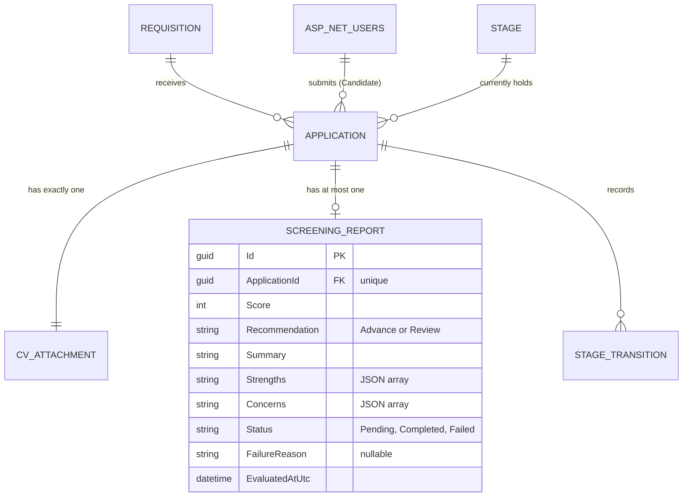

# Data Model — 0008 Automated Candidate Screening

**Spec:** `../spec.md` · **Updated:** 2026-08-14

> **Model inheritance.** Read `plan/erd.md` of `0004`, `0005` first. `0004` established
> `Applications`/`CvAttachments` (PascalCase tables, `TEXT`-typed `Guid` PKs, per-entity
> `IEntityTypeConfiguration<T>`, `*AtUtc` timestamp naming); `0005` established
> `StageTransitions` and the `ActorKind` enum with a `System` value (column shape only, no
> code path in that spec writes it). This spec adds one new table following the same conventions
> and is the first to write `ActorKind.System` transitions.

---

## 1. Diagram

`Requisition`, `AspNetUsers`, `CvAttachment`, `Stage`, `StageTransition` are shown only as
neighbours — referenced or used by the screening flow, but not modified by this spec's
migration. `StageTransition` gains a new factory method (`CreateSystemMove`) in code, but its
table schema is unchanged.

## 2. Delta Summary

| Change | Entity | Detail |
|---|---|---|
| New table | `ScreeningReports` | AI-generated evaluation of a candidate's CV against a Requisition's job criteria. 1-to-1 with `Applications` via a unique FK. Stores score (0–100), recommendation (`Advance`/`Review`), a summary, lists of strengths and concerns (JSON-encoded strings), evaluation status, and optional failure reason. |
| Unchanged (code-only change) | `StageTransitions` | New `CreateSystemMove` factory on the C# entity — sets `ActorKind = System`, `ActorUserId = null`. No schema change; the column shapes and enum values already exist (0005). |
| Unchanged (navigation added) | `Applications` | Gains an optional navigation property `ScreeningReport?` in C#. No column added to the `Applications` table — the FK is on `ScreeningReports`. |
| Unchanged (referenced, not modified) | `Requisitions` | `Title`/`Description` read as evaluation criteria. |
| Unchanged (referenced, not modified) | `CvAttachments` | `StorageKey` read to open the PDF file for text extraction. |
| Unchanged (referenced, not modified) | `Stages` | `SortOrder` read to determine the initial and next Stages for auto-advance. |

## 3. Table Definitions

### 3.1 `ScreeningReports` *(new)*

| Column | Type | Null | Default | Notes |
|---|---|---|---|---|
| `Id` | TEXT (Guid) | No | | PK |
| `ApplicationId` | TEXT (Guid) | No | | FK → `Applications.Id`, ON DELETE CASCADE. Unique — enforces the 1-to-1 relationship. |
| `Score` | INTEGER | No | `0` | 0–100 inclusive. Validated in the entity's `Complete()` method, not by a CHECK constraint (consistent with 0003's `Requisitions.Status` precedent). Default 0 is meaningful only in `Pending` state; overwritten when transitioning to `Completed`. |
| `Recommendation` | TEXT | No | `'Review'` | `'Advance'` \| `'Review'`, `HasConversion<string>()`. Default `Review` is the safe initial value for `Pending` state. |
| `Summary` | TEXT | No | `''` | Evaluation summary text. Empty in `Pending` state. |
| `Strengths` | TEXT | No | `'[]'` | JSON-encoded string array of identified candidate strengths. Empty array in `Pending`/`Failed` state. |
| `Concerns` | TEXT | No | `'[]'` | JSON-encoded string array of identified concerns/gaps. Empty array in `Pending`/`Failed` state. |
| `Status` | TEXT | No | | `'Pending'` \| `'Completed'` \| `'Failed'`, `HasConversion<string>()`. |
| `FailureReason` | TEXT | Yes | | Non-null only when `Status = 'Failed'`. |
| `EvaluatedAtUtc` | TEXT (DateTime) | No | | Set on creation (`Pending`) and updated when transitioning to `Completed` or `Failed`. |

**Indexes**

| Name | Columns | Type | Rationale |
|---|---|---|---|
| `IX_ScreeningReports_ApplicationId` | `ApplicationId` | Unique | Structural 1-to-1 — an Application can have at most one ScreeningReport. Also serves the `GET .../screening-report` query (where the lookup is by ApplicationId). |

**Constraints.** Primary key on `Id`. FK `ApplicationId → Applications.Id`, `NOT NULL`, `ON
DELETE CASCADE` — dormant, same pattern as `CvAttachments → Applications` (0004); no
Application-delete endpoint exists.

**Retention.** On re-screen (FR-8), the existing row is deleted and a new one is created (not
updated). No independent delete path otherwise — retained for the lifetime of the Application.

## 4. Relationships

| From | To | Cardinality | On delete | Notes |
|---|---|---|---|---|
| `ScreeningReports` | `Applications` | one-to-one | CASCADE | Dormant — no Application-delete endpoint exists. If the Application is ever deleted, the report goes with it. |

## 5. Migrations

Single migration (`AddScreeningReport`), pure table creation — no existing table is altered.

| # | Operation | Reversible | Backfill | Downtime |
|---|---|---|---|---|
| 1 | `CreateTable("ScreeningReports")` with all columns/FKs/conversions from §3.1 | Yes — `DropTable` | None | None — new, empty table |
| 2 | `CreateIndex("IX_ScreeningReports_ApplicationId", unique: true)` | Yes — `DropIndex` | None | None |

**Rollback plan.** `dotnet ef database update AddSeedSampleAccounts --project src/Db` (the
prior migration) drops the new table. No data loss to other tables.

## 6. Data Volume & Growth

| Table | Initial rows | Growth | Notes affecting indexing |
|---|---|---|---|
| `ScreeningReports` | 0 | At most 1 per `Application` (1:1); grows linearly with Applications. Re-screens delete + insert, not append. | Trivially small; the unique index on `ApplicationId` is sufficient for the single query pattern this spec uses. |

## 7. Seed / Reference Data

None. `ScreeningReports` are generated at runtime by the screening service.

## 8. PII & Retention

| Column | Classification | Retention | Deletion path |
|---|---|---|---|
| `ScreeningReports.Summary` | Indirect PII — may reference candidate qualifications extracted from their CV | Indefinite (no delete path in this spec) | N/A — inherits from Application lifecycle |
| `ScreeningReports.Strengths` | Indirect PII — derived from CV analysis | Indefinite | N/A |
| `ScreeningReports.Concerns` | Indirect PII — derived from CV analysis | Indefinite | N/A |

The screening report content is derived from the candidate's CV, which is already classified
as PII in `0004`'s `erd.md` §8. The derived report inherits the same classification and
retention posture. Screening data is never exposed to candidates (FR-11, AC-8).

## Related Specs

| Spec | Tier | Why loaded |
|---|---|---|
| `0004` (Application Submission and CV Upload) | 1 | `Applications` table is the parent; `CvAttachments.StorageKey` is read for PDF extraction. Reused the PascalCase table, `Guid`-as-`TEXT` PK, `*AtUtc` timestamp, `ON DELETE CASCADE` (dormant) conventions. |
| `0005` (Pipeline Progression) | 1 | `StageTransitions` table is written via the new `CreateSystemMove` factory; no schema change, only a new C# code path. `Stages.SortOrder` is read for auto-advance resolution. |
| `0003` (Requisition Management) | 1 | `Requisitions.Title`/`Description` are the evaluation criteria — read only, no column or index change. |
