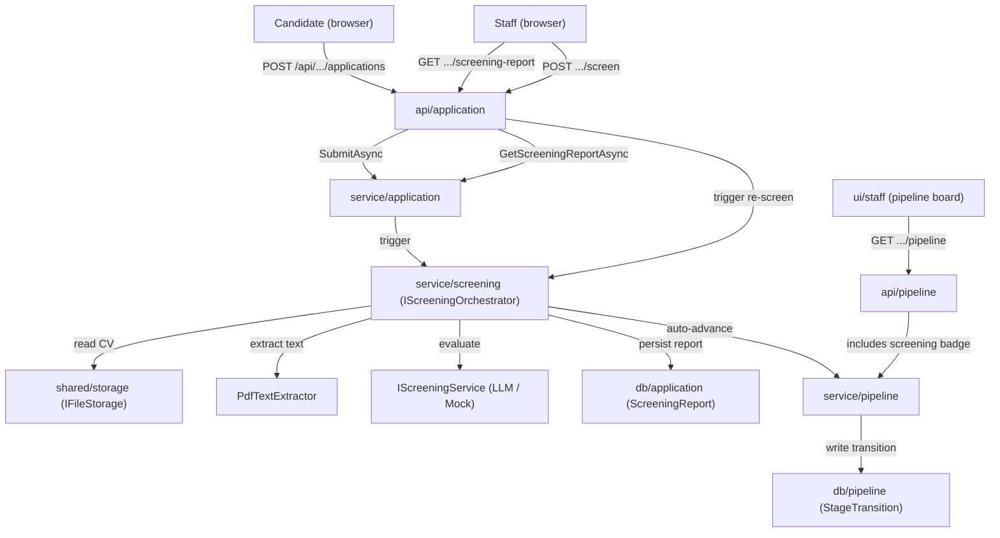
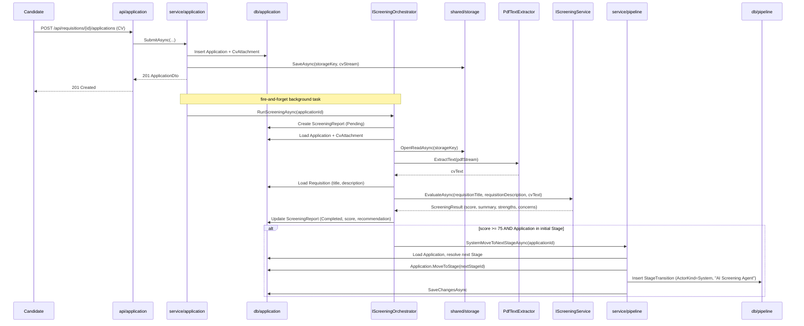
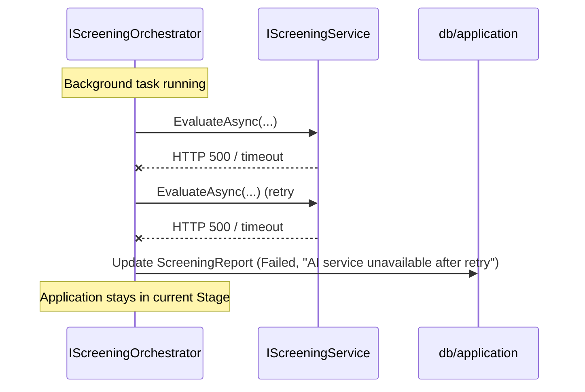

# High-Level Design — 0008 Automated Candidate Screening

**Spec:** `../spec.md` · **Updated:** 2026-08-14

---

## 1. Solution Overview

The system gains an **AI-powered screening pipeline** that evaluates every incoming Application
against the target Requisition's job criteria, without blocking the candidate's submission
response. Three new capabilities emerge:

1. **Background screening on submission.** After `ApplicationService.SubmitAsync` persists the
   Application and CV, it fires a background screening task via `IScreeningOrchestrator`.
   Screening extracts text from the stored PDF, calls an `IScreeningService` implementation,
   and writes a `ScreeningReport`. If the report recommends `Advance` and the Application is
   still in the initial Stage, it auto-advances the Application to the next sequential Stage.

2. **On-demand re-screening.** A `RecruiterOnly` POST endpoint lets a Recruiter re-run
   screening for any non-rejected Application. The existing report is replaced.

3. **Staff-facing screening visibility.** The pipeline board and staff Application lists gain a
   screening score/recommendation badge; the Application detail page exposes the full report
   via a dedicated GET endpoint.

**The single most important design decision** is **D-1: screening runs as an in-process
background task**, not via a durable queue or external worker. This keeps the architecture
within the existing component map (no `worker/*` component) while satisfying NFR-1's
requirement that submission is not blocked. The trade-off is that an in-flight screening is
lost on process restart — acceptable given the re-screen button and the early-stage nature
of the product.

## 2. Context Diagram

## 3. Component Table

| Component | Status | Responsibility | Collaborators |
|---|---|---|---|
| `service/screening` | New | `IScreeningOrchestrator` coordinates PDF text extraction, `IScreeningService` invocation, `ScreeningReport` persistence, and conditional auto-advance. `IScreeningService` is the pluggable AI abstraction; `MockScreeningService` is the deterministic test/dev provider. `PdfTextExtractor` handles raw PDF-to-text conversion. | `shared/storage`, `db/application`, `service/pipeline` |
| `api/application` | Modified | Two new staff endpoints: `GET /api/staff/applications/{id}/screening-report` (`StaffOnly`) and `POST /api/staff/applications/{id}/screen` (`RecruiterOnly`). | `service/screening`, `service/application` |
| `service/application` | Modified | `SubmitAsync` fires the screening orchestrator after persisting the Application, without awaiting completion (fire-and-forget background task). | `service/screening` |
| `service/pipeline` | Modified | New `SystemMoveToNextStageAsync` helper for auto-advance: resolves the next sequential Stage from the current one, writes a `StageTransition` with `ActorKind.System` / label `"AI Screening Agent"`, and moves the Application. Reuses the existing optimistic concurrency pattern. | `db/pipeline`, `db/application` |
| `db/application` | Modified | New `ScreeningReport` entity (1-to-1 with `Application`), navigation property on `Application`, EF Core configuration, migration. | — |
| `api/pipeline` | Modified | `GET .../pipeline` response gains optional screening badge fields on each `PipelineBoardApplicationDto`. | `service/pipeline` |
| `shared/storage` | Unchanged | CV file read via `IFileStorage.OpenReadAsync` to feed PDF text extraction. | — |
| `ui/staff` | Modified | Score badge on pipeline board cards and Applications list; full report view on Application detail; "Re-run Screening" button for Recruiters. | — |

## 4. Sequence Diagrams

### 4.1 Happy Path — Submission triggers screening and auto-advance (AC-1, AC-2)

### 4.2 Failure Path — AI service outage (AC-4)

## 5. Design Decisions

| Id | Decision | Alternatives Considered | Rationale |
|---|---|---|---|
| D-1 | Screening runs as an in-process background task (`Task.Run` with a scoped DI container) rather than a durable queue or external worker | (a) Durable queue (Hangfire, Azure Queue) — reliable but adds a dependency; (b) No background processing — simpler but blocks the submission response | The architecture has no `worker/*` component and `tech-stack.md` lists Queue/Background as "None". Adding Hangfire or similar would be a new technology requiring approval. A fire-and-forget task with a try/catch satisfies NFR-1 and NFR-2; the re-screen button (FR-7) is the recovery mechanism for lost in-flight work. |
| D-2 | PDF text extraction via `itext7` (or `PdfPig` — a lighter, MIT-licensed .NET PDF reader) instead of an external service | (a) External PDF parsing API (Tika, cloud service) — more robust but adds a network dependency and cost; (b) System.Text only — no PDF parsing available in the BCL | A local PDF text extraction library keeps the system self-contained and avoids a new integration point. `PdfPig` is preferred: MIT-licensed, pure .NET, no native dependencies, sufficient for extracting text from standard PDFs. |
| D-3 | `ScreeningReport` is 1-to-1 with `Application` and replaced on re-screen, not versioned | (a) Versioned history (one-to-many) — more auditable but adds complexity with no spec requirement | The spec says "updates or replaces" (FR-8). A single report per Application keeps queries simple and the schema flat. If versioned history becomes a requirement, it is an additive schema change. |
| D-4 | The `StageTransition.CreateMove` factory gains a new `CreateSystemMove` overload that accepts no `actorUserId` (null) and uses `ActorKind.System` | (a) Reuse the existing `CreateMove` with a sentinel Guid — misleading, no real user row to reference; (b) A separate transition `Kind` — over-engineering, it is still a move | The existing factory forces a non-empty `actorUserId` for `User` moves. A separate factory method avoids relaxing that invariant while cleanly accommodating the system actor case. |
| D-5 | Qualification threshold (75) is a configuration value (`Screening:QualificationThreshold`), not hard-coded | (a) Hard-coded constant — simpler; (b) Per-Requisition threshold — deferred as out of scope | A config value costs nothing and allows tuning without redeployment. Per-Requisition thresholds are a deferred enhancement (spec Non-Goal). |

## 6. Non-Functional Approach

| NFR | Mechanism |
|---|---|
| NFR-1 (submission not blocked) | Screening fires as a background `Task.Run` after the HTTP 201 response has been sent. The orchestrator creates its own DI scope. |
| NFR-2 (submission survives AI outage) | The orchestrator wraps AI calls in try/catch; on failure, it sets the report to `Failed` and returns. The Application row (committed in the submission transaction) is never rolled back. |
| NFR-3 (CV PII not logged) | The orchestrator and `IScreeningService` log Application IDs and scores only. CV text, strengths, concerns, and summaries are persisted to the database but never passed to `ILogger`. The `PdfTextExtractor` logs extraction success/failure with the storage key, not the text content. |

## 7. Security and Authorization

| Action | Who | Where enforced |
|---|---|---|
| Trigger screening on submission | System (automatic) | Internal — no external caller can invoke the background task directly |
| Re-run screening | `Recruiter` only | `RecruiterOnly` policy on `POST /api/staff/applications/{id}/screen` |
| View screening report | `Recruiter`, `HiringManager` | `StaffOnly` policy on `GET /api/staff/applications/{id}/screening-report` |
| View screening badge on pipeline board | `Recruiter`, `HiringManager` | `StaffOnly` policy on `GET /api/requisitions/{id}/pipeline` (existing) |
| View screening data as Candidate | Denied | `GET /api/applications/mine` does not include screening fields; the screening-report endpoint is `StaffOnly` (AC-8) |
| Send CV text to AI provider | System | PII is sent only to the configured `IScreeningService` implementation; never logged |

## 8. Risks

| # | Risk | Likelihood | Impact | Mitigation |
|---|---|---|---|---|
| R-1 | In-flight screening lost on process restart — the report stays `Pending` forever | Medium | Low | The re-screen button (FR-7) lets a Recruiter manually recover. A future spec could add a startup sweep for stale `Pending` reports. |
| R-2 | PDF text extraction produces empty or garbled output from non-standard PDFs | Medium | Medium | Edge case E-1 handles this: `ScreeningReport` is marked `Failed` with a descriptive reason. OCR is explicitly out of scope. |
| R-3 | LLM provider returns inconsistent or hallucinated scores | Medium | Medium | The `MockScreeningService` is the default in development/CI, producing deterministic results. The LLM provider is behind `IScreeningService`, so it can be swapped or wrapped with validation. The spec does not promise clinical accuracy — the score is advisory with a human review gate (FR-5). |

## Related Specs

| Spec | Tier | Why loaded |
|---|---|---|
| `0004` (Application Submission and CV Upload) | 1 | Defines `Application`, `CvAttachment`, `IFileStorage`, and the submission flow this spec hooks into post-commit. Read `spec.md` ACs, `plan/api.md`, `plan/erd.md` in full. |
| `0005` (Pipeline Progression) | 1 | Defines `Stage`, `StageTransition`, `ActorKind.System`, `PipelineService`, the pipeline board, and the move semantics this spec's auto-advance reuses. Read `spec.md` ACs, `plan/api.md`, `plan/erd.md` in full. |
| `0003` (Requisition Management) | 1 | Defines `Requisition.Title`/`Description` used as evaluation criteria. Read frontmatter + ACs only (no API/ERD changes in this spec's scope). |

Tier 0 read in full: `meta/architecture.md`, `meta/tech-stack.md`, `meta/coding-standards.md`, `docs/specs/index.md`.
