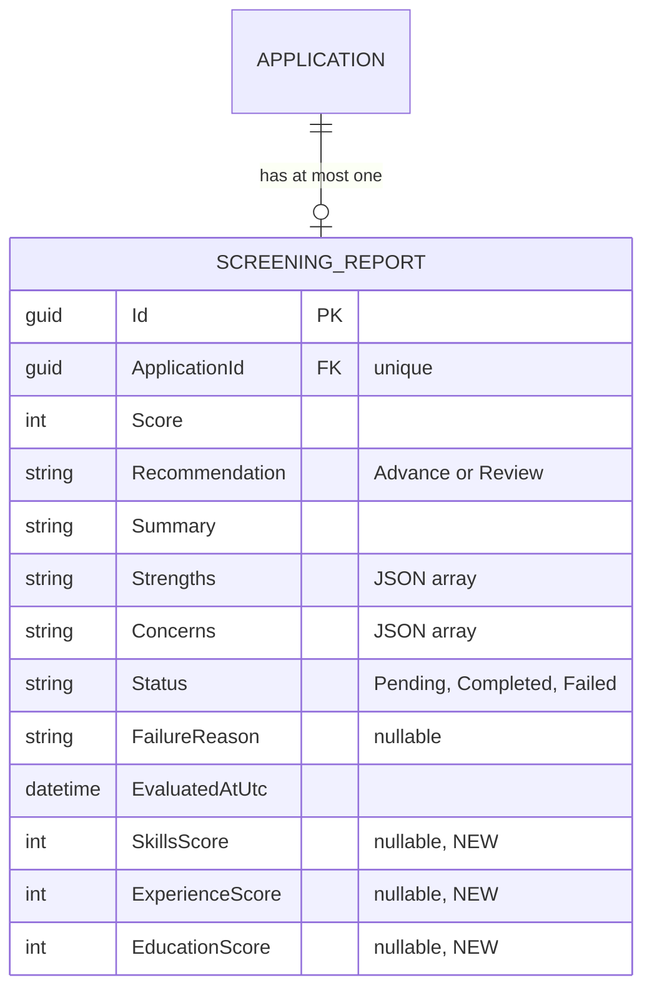

# Data Model — 0009 Google Gemini 2.0 Flash Candidate Screening Integration

**Spec:** `../spec.md` · **Updated:** 2026-08-14

> **Model inheritance.** Read `plan/erd.md` of `0008` first. `0008` established the
> `ScreeningReports` table (PascalCase table name, `TEXT`-typed `Guid` PK, 1-to-1 FK to
> `Applications`, `HasConversion<string>()` for enums, `*AtUtc` timestamp naming).
> This spec adds three nullable `INTEGER` columns to the existing table.

---

## 1. Diagram

Only the `ScreeningReports` table is shown — it is the only table this spec modifies.
`Applications`, `Requisitions`, `CvAttachments`, `Stages`, `StageTransitions` are
referenced but unchanged by this spec.

## 2. Delta Summary

| Change | Entity | Detail |
|---|---|---|
| Altered table | `ScreeningReports` | Three new nullable `INTEGER` columns: `SkillsScore`, `ExperienceScore`, `EducationScore`. Store granular category breakdown scores (0–100 each) when available from the AI provider; `null` for legacy/mock evaluations or failed reports. |
| Unchanged | `Applications` | Navigation to `ScreeningReport?` — no column change. |
| Unchanged | `Requisitions` | `Title`/`Description` read as evaluation criteria. |
| Unchanged | `CvAttachments` | `StorageKey` read for PDF text extraction. |
| Unchanged | `Stages` | `SortOrder` read for auto-advance. |
| Unchanged | `StageTransitions` | `CreateSystemMove` factory writes auto-advance records. |

## 3. Table Definitions

### 3.1 `ScreeningReports` *(altered — three columns added)*

Only the delta is documented. All existing columns from 0008's `erd.md` §3.1 remain
unchanged.

| Column | Type | Null | Default | Notes |
|---|---|---|---|---|
| `SkillsScore` | INTEGER | Yes | `null` | 0–100 when provided by the AI provider. `null` for mock evaluations without category support, pre-0009 reports, or failed screenings. Clamped in the entity's `Complete()` method. |
| `ExperienceScore` | INTEGER | Yes | `null` | Same semantics as `SkillsScore` — evaluates candidate's relevant work experience fit. |
| `EducationScore` | INTEGER | Yes | `null` | Same semantics as `SkillsScore` — evaluates candidate's educational background fit. |

**Indexes**

No new indexes. The existing unique index on `ApplicationId` is sufficient. Category
scores are not independently queried — they are retrieved as part of the full
`ScreeningReport` row via the `ApplicationId` lookup.

**Rationale for nullable.** Pre-existing `ScreeningReport` rows (created by 0008's
`MockScreeningService`) have no category scores. Making the columns nullable avoids a
destructive backfill or a default value that would be misleading. The frontend handles
`null` by hiding the category breakdown section.

## 4. Relationships

No new relationships. The existing 1-to-1 between `ScreeningReports` and `Applications`
(FK, unique index, `ON DELETE CASCADE`) is unchanged.

## 5. Migrations

Single migration (`AddScreeningCategoryScores`), pure column addition — no table rebuild,
no existing data modified.

| # | Operation | Reversible | Backfill | Downtime |
|---|---|---|---|---|
| 1 | `AddColumn("SkillsScore", "INTEGER", nullable: true)` on `ScreeningReports` | Yes — `DropColumn` | None | None — nullable column, no default |
| 2 | `AddColumn("ExperienceScore", "INTEGER", nullable: true)` on `ScreeningReports` | Yes — `DropColumn` | None | None |
| 3 | `AddColumn("EducationScore", "INTEGER", nullable: true)` on `ScreeningReports` | Yes — `DropColumn` | None | None |

> **SQLite note.** SQLite supports `ALTER TABLE ... ADD COLUMN` natively for nullable
> columns without defaults, so EF Core will not need a table rebuild for this migration.
> This is one of the safe ALTER operations on SQLite.

**Rollback plan.** `dotnet ef database update AddScreeningReport --project src/Db` (the
prior migration from 0008) drops the three new columns and the migration history entry.

## 6. Data Volume & Growth

No change from 0008. `ScreeningReports` grows at most 1 row per Application.
Three additional `INTEGER` columns add negligible storage overhead (~12 bytes per row).

## 7. Seed / Reference Data

None. `ScreeningReports` are generated at runtime by the screening service.

## 8. PII & Retention

No change from 0008. The three new columns (`SkillsScore`, `ExperienceScore`,
`EducationScore`) contain only integer scores — no PII. The existing PII classification
from 0008's `erd.md` §8 (Summary, Strengths, Concerns as indirect PII) remains accurate.

## Related Specs

| Spec | Tier | Why loaded |
|---|---|---|
| `0008` (Automated Candidate Screening) | 1 | Established the `ScreeningReports` table this spec alters. Reused: PascalCase table name, `TEXT`-typed `Guid` PK, nullable column pattern, `IEntityTypeConfiguration<T>` approach, `*AtUtc` naming. |
| `0004` (Application Submission and CV Upload) | 1 | Parent table `Applications` — FK target, CASCADE delete. |
| `0005` (Pipeline Progression) | 1 | `StageTransitions` written by auto-advance — no schema change. |

Tier 0 read in full.
Considered and skipped: `0001`, `0002`, `0003`, `0006`, `0007`.
Cap reached: no.
