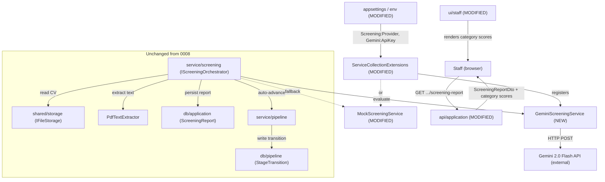
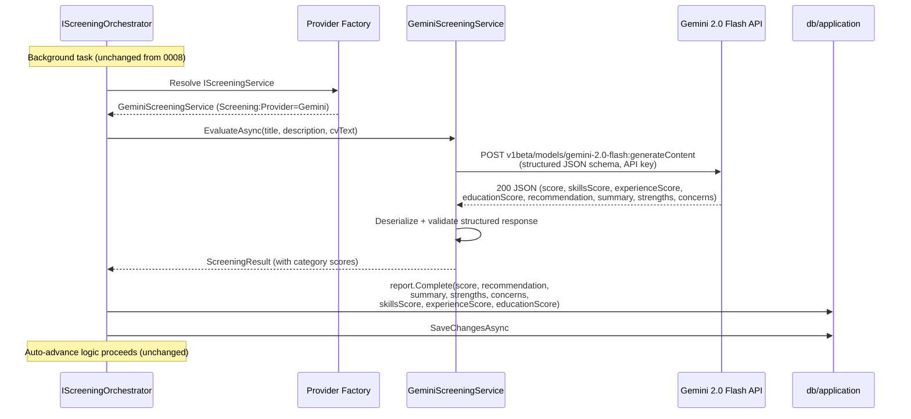
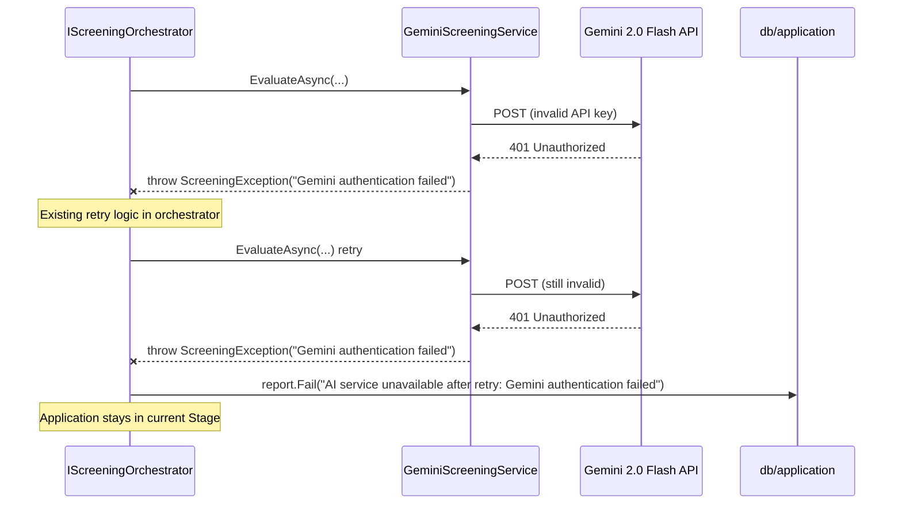
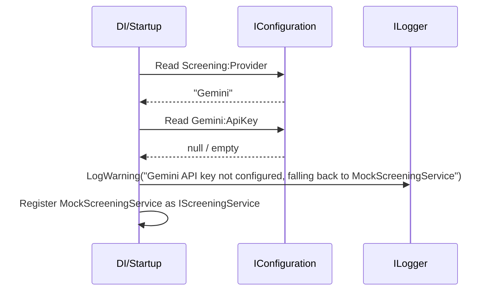

# High-Level Design — 0009 Google Gemini 2.0 Flash Candidate Screening Integration

**Spec:** `../spec.md` · **Status:** planned · **Updated:** 2026-08-14

---

## 1. Solution Overview

This spec replaces the deterministic keyword-matching `MockScreeningService` with a production-ready `GeminiScreeningService` that calls Google's Gemini 2.0 Flash model via its REST API, while keeping the mock as a fallback for offline/CI environments. **The single most important design decision** is **D-1: provider selection is explicit configuration, not autodetection** — `Screening:Provider` chooses `Gemini` or `Mock`, with a graceful fallback to Mock when the Gemini API key is missing. The feature also extends the `ScreeningReport` schema and all downstream DTOs/UI components with three category breakdown scores (Skills, Experience, Education), giving staff granular insight into why a candidate scored the way they did. The existing orchestration, auto-advance, retry, and background-task machinery from 0008 is reused unchanged — only the `IScreeningService` implementation and the data shape widen.

## 2. Context Diagram

## 3. Components

| Component | New/Modified | Responsibility | Key collaborators |
|---|---|---|---|
| `service/screening` | Modified (new file + modified files) | Adds `GeminiScreeningService` (typed `HttpClient` to Gemini REST API with structured JSON schema, retry with backoff). Modifies `ScreeningResult` to add category scores. Modifies `MockScreeningService` to produce category scores. Adds `GeminiOptions` configuration model. | Gemini 2.0 Flash API (external) |
| `db/application` | Modified | Adds `SkillsScore`, `ExperienceScore`, `EducationScore` nullable int columns to `ScreeningReport` entity and EF config. New migration. | — |
| `api/application` | Modified | Updates `ScreeningReportDto` to include category breakdown fields. Existing endpoint shapes unchanged. | `service/screening` |
| `ui/staff` | Modified | `ScreeningReportCard`, `ScreeningReportModal`, and TS types updated to render the three category scores. | — |

## 4. Key Flows

### 4.1 Happy Path — Gemini 2.0 Flash evaluation with category scores (AC-1, AC-3)

### 4.2 Failure Path — Gemini API key invalid (AC-6, E-1)

### 4.3 Fallback Path — Gemini configured but API key missing (AC-2)

## 5. Design Decisions

| # | Decision | Alternatives considered | Rationale |
|---|---|---|---|
| D-1 | Provider selection is explicit via `Screening:Provider` config key (`Gemini` or `Mock`) with fallback to Mock when Gemini key is absent | (a) Autodetect based on API key presence — simpler but surprising in staging; (b) Strict mode that fails startup — blocks local dev | Explicit configuration prevents accidental Gemini calls in staging, satisfies the user's C-1 choice, and keeps CI deterministic. Fallback is graceful, not silent — it logs a warning. |
| D-2 | Direct typed `HttpClient` against Gemini REST API rather than third-party SDK | (a) `Mscc.GenerativeAI` NuGet — convenient but adds an external dependency not in `tech-stack.md`; (b) `Google.GenAI` — official but heavyweight | The project's modular monolith has no external AI SDK dependencies. A typed `HttpClient` with `System.Text.Json` stays within the existing stack and gives full control over retry, timeout, and structured schema enforcement. The user's C-2 choice. |
| D-3 | Category breakdown scores are nullable `int?` on `ScreeningReport`, not a separate table | (a) Separate `ScreeningCategoryScore` entity — normalised but over-engineered for three fixed scores; (b) JSON blob — flexible but loses queryability | Three fixed columns is simpler, queryable, and forward-compatible. `null` correctly represents reports from the Mock provider (0008 era) or failed evaluations. Nullable avoids a breaking backfill. |
| D-4 | `ScreeningResult` record gains three optional category score fields, preserving backward compatibility with existing orchestrator | (a) New result type — breaks the orchestrator contract; (b) Dictionary of scores — untyped | Adding optional fields to the existing record is the least disruptive change. The orchestrator's `Complete()` call gains three new parameters with null defaults. |

## 6. Data Model Impact

- Modified entity: `ScreeningReport` — adds `SkillsScore` (`int?`), `ExperienceScore` (`int?`), `EducationScore` (`int?`)
- New entities: none
- Migrations required: yes — `AddScreeningCategoryScores` adds three nullable INTEGER columns. No backfill needed (nulls are correct for pre-existing rows).

## 7. Non-Functional Approach

| NFR | How the design satisfies it |
|---|---|
| NFR-1 (p95 < 5s evaluation) | Gemini 2.0 Flash is Google's fastest production model. The typed `HttpClient` is configured with a 30-second timeout. Structured JSON schema enforcement eliminates post-hoc parsing. |
| NFR-2 (API keys never logged) | `GeminiOptions.ApiKey` is loaded via `IOptions<GeminiOptions>` bound from configuration. The key is appended as a query parameter (`?key=`) per Google's API convention and never interpolated into log messages. `ILogger` calls log only Application IDs and scores. |
| NFR-3 (CV PII not logged) | Unchanged from 0008 — CV text is passed to `IScreeningService.EvaluateAsync` but never logged. The Gemini request body is not logged. |
| NFR-4 (offline tests) | Unit tests mock `HttpMessageHandler` to simulate Gemini API responses. Integration tests use `MockScreeningService`. No live network calls in CI. |

## 8. Security & Authorization

- **Who can do what:** Unchanged from 0008. Recruiter re-screens; Staff views reports; Candidates see nothing.
- **Enforcement point:** `RecruiterOnly` and `StaffOnly` ASP.NET Core policies on `api/application` endpoints (unchanged).
- **Data exposure:** Category breakdown scores are added to `ScreeningReportDto` — staff-only, same policy as the overall score. `GET /api/applications/mine` (candidate-facing) does not include any screening fields.
- **API key security:** The Gemini API key is a server-side secret, loaded from user-secrets or environment variables, never sent to the frontend or logged.

## 9. Risks & Mitigations

| # | Risk | Likelihood | Impact | Mitigation |
|---|---|---|---|---|
| R-1 | Gemini API rate limits (429) during high-volume submission bursts | Medium | Medium | Exponential backoff retry (up to 2 retries). The orchestrator's existing retry wraps the service; `GeminiScreeningService` also handles 429 internally. Failed reports are recoverable via re-screen. |
| R-2 | Gemini returns JSON that technically validates the schema but contains nonsensical scores (e.g. all zeros, or scores outside 0-100) | Low | Low | Scores are clamped to 0-100 in the `ScreeningReport.Complete()` method (existing). The structured JSON schema constrains the model's output format. Advisory-only nature means human review catches outliers. |
| R-3 | Gemini API breaking changes (endpoint URL, schema enforcement behaviour) | Low | High | The model name and base URL are configurable via `GeminiOptions`. The typed `HttpClient` and response deserialization are isolated in `GeminiScreeningService`, so a fix is localised to one file. |

## 10. Rollout Considerations

- **Migration:** `AddScreeningCategoryScores` adds three nullable columns — no data loss, no backfill, fully reversible via `dotnet ef database update AddScreeningReport`.
- **Feature flag:** Not needed. The `Screening:Provider` config key effectively acts as a feature toggle — set to `Mock` to disable Gemini without code changes.
- **Backward compatibility:** Existing API consumers see three new nullable fields (`skillsScore`, `experienceScore`, `educationScore`) in `ScreeningReportDto` — purely additive, no breaking change.

## Related Specs

| Spec | Tier | Why loaded |
|---|---|---|
| `0008` (Automated Candidate Screening) | 1 | Parent spec. Read `spec.md` ACs, `plan/hld.md`, `plan/api.md`, `plan/erd.md` in full — the orchestrator, service interface, entity, and endpoint shapes this spec extends. |
| `0004` (Application Submission and CV Upload) | 1 | Read `plan/api.md` and `plan/erd.md` — `Application`, `CvAttachment`, submission flow conventions. |
| `0005` (Pipeline Progression) | 1 | Read `plan/api.md` and `plan/erd.md` — `StageTransition`, auto-advance semantics, pipeline board DTO. |

Tier 0 read in full: `meta/architecture.md`, `meta/tech-stack.md`, `meta/coding-standards.md`, `docs/specs/index.md`.
Considered and skipped: `0001`, `0002`, `0003`, `0006`, `0007`.
Cap reached: no.
