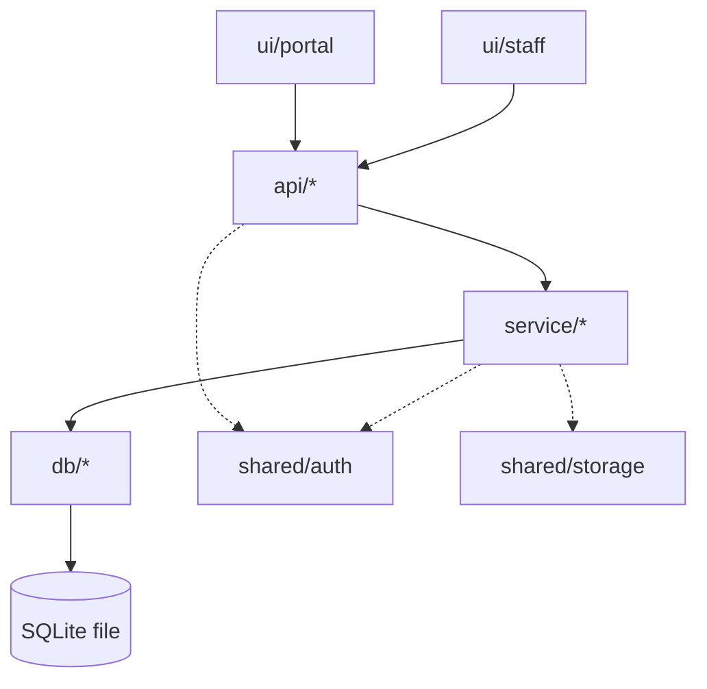
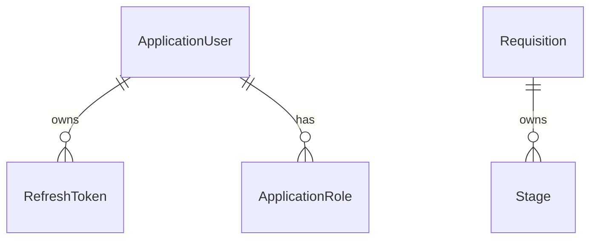

# Architecture Snapshot

**Updated:** 2026-08-05 · **Budget:** 150 lines target / 200 hard ceiling

> The orientation document. A developer or agent reads this file and nothing else, and knows
> what exists and how it fits together. Detail belongs in the per-spec artifacts; see
> `.spec-kit/meta-maintenance.md` for what may and may not live here.
>
> Maintained by `/implement` via surgical edits. Never regenerate this file.

**Nothing below is built yet.** This is the *intended* structure agreed at initialisation.
Component rows carry no owning spec until `/implement` ships them.

---

## Purpose

An applicant tracking system for a single organisation: recruiters and hiring managers manage
requisitions and move applications through a hiring pipeline, while candidates self-register
on a public portal, apply with a CV, and track their own status. Single-tenant — no tenant
partitioning anywhere. The defining constraint is SQLite as the datastore, which bounds
concurrent write throughput and the mechanics of schema change.

## Tech Stack

| Layer | Technology | Notes |
|---|---|---|
| Frontend | Next.js (App Router), React, TypeScript on Node 24 | Separate deployable; version pinned at scaffold |
| Backend | ASP.NET Core on .NET 10 (LTS) | Modular monolith, one deployable |
| Database | SQLite via EF Core | File-on-disk; see Known Constraints |
| Auth | ASP.NET Core Identity + JWT bearer | Self-hosted; one Identity store, roles separate Staff from Candidate |
| Infrastructure | TBD | Deliberately deferred; the first infra-touching spec decides |
| Testing | xUnit (backend), Vitest + Testing Library (frontend) | Assumed ecosystem defaults; nothing scaffolded |

Detail and exact versions live in `tech-stack.md`.

Two constraints follow from SQLite and are accepted, not defects:

- **One writer.** Writes serialise across the whole database file. A public candidate portal
  concentrates writes (registration, submission, upload) exactly when traffic spikes. If
  concurrent submission volume ever becomes a real target, the datastore is the thing that
  moves first. WAL mode and short transactions mitigate; they do not remove the limit.
- **No in-place ALTER for most changes.** EF Core emulates column drops and type changes by
  rebuilding the table, so migrations that read as trivial are table rebuilds. Review every
  migration for data loss before running it.

## Component Map

The system is **two deployables**, not one. The backend is a modular monolith — a single
ASP.NET Core process containing all `api/*`, `service/*`, and `db/*` modules. The Next.js
frontend is a second process that reaches it only over HTTP. "Modular monolith" describes
the backend; it does not mean the UI ships inside it.

| Component | Responsibility | Owning specs |
|---|---|---|
| `infra/build` | Repository build, version pinning, lockfile and lint/format infrastructure | 0001 |
| `ui/portal` | Public candidate surface: landing page system status, registration, job search, apply | 0001, 0003 |
| `ui/bff` | Frontend BFF layer: proxy route handlers and shared backend invoke function | 0001, 0002 |
| `ui/staff` | Authenticated recruiter and hiring-manager workspace: requisitions, pipeline, decisions | 0003 |
| `api/system` | Backend HTTP boundary: system status & auth endpoints, composition root | 0001, 0002 |
| `api/requisition` | Staff CRUD/lifecycle endpoints (`RecruiterOnly`/`StaffOnly`) plus anonymous public search/detail endpoints under `/api/public/requisitions` | 0003 |
| `api/<area>` | HTTP boundary — routing, request DTOs, authorization policies | — |
| `service/system` | Backend system status, auth service, and database health check | 0001, 0002 |
| `service/requisition` | Requisition lifecycle state machine (draft/published/closed transition guards), content validation, keyword search + pagination | 0003 |
| `service/<area>` | Business rules and transaction boundaries. The only caller of `db/*` | — |
| `db/core` | EF Core context, SQLite WAL/busy-timeout interceptor, health check, migrations | 0001, 0002 |
| `db/requisition` | `Requisition`/`Stage` entities, EF Core configurations, migration — each Requisition owns an independent Stage set (FR-14) | 0003 |
| `db/<area>` | EF Core entities, configurations, migrations, query implementations | — |
| `shared/auth` | Identity store, JWT issuance and validation, role and claim policy definitions | 0002 |
| `shared/storage` | CV and attachment persistence behind an interface; backing store TBD | — |

Both `ui/portal` and `ui/staff` live inside the one Next.js application as separate route
groups. They are distinct components because their auth posture differs: `ui/portal` serves
anonymous traffic, `ui/staff` never does.

This table is the authoritative list of component paths (see `conventions.md` §5).

## Data Model

Entities and relationships only. Columns live in each spec's `plan/erd.md`.

## Cross-Cutting Concerns

| Concern | Mechanism | Implemented in |
|---|---|---|
| Authentication | ASP.NET Core Identity, JWT bearer tokens issued by the API | `shared/auth` |
| Authorization | Role-based policies; `Candidate` and staff roles (`Recruiter`, `HiringManager`) are mutually exclusive | `shared/auth`, enforced at `api/*` |
| Validation | Request DTOs validated at the `api/*` boundary; domain invariants re-checked in `service/*` | `api/*`, `service/*` |
| Error handling | RFC 7807 ProblemDetails for every HTTP error response | `api/*` global handler |
| Logging & tracing | `Microsoft.Extensions.Logging`, structured, no PII in messages | Backend host |
| Configuration | `IOptions<T>` bound from appsettings + environment; secrets via user-secrets locally | Backend host |
| Background work | None. No `worker/*` component exists | — |

**Staff and candidate identities share one Identity store.** They are separated by role, not
by table: a `Candidate` principal may only ever reach its own applications, and no staff
policy is satisfiable by a candidate token. Any endpoint reachable by both roles must state
so explicitly.

**Token handling across the HTTP boundary is unresolved.** The API issues the JWT; where the
Next.js app stores it and how server components and route handlers read it is TBD, settled by
the first authentication spec. Guessing it here would be a defect.

> **Assumption:** ProblemDetails, built-in `ILogger`, and `IOptions` are ecosystem defaults
> the user did not specify. Each is a one-file change to reverse before code exists.

## Integration Points

| Service | Purpose | Direction | Owning spec |
|---|---|---|---|
| — | — | — | — |

None yet. A transactional email provider will be required by the first spec that implements
candidate registration or password reset; it is not chosen.

## Layering Rules

The constraints `/validate` checks against. Keep to five or fewer.

1. `ui/*` reaches the backend only over HTTP. The Next.js app never references EF Core, a
   connection string, or the SQLite file.
2. `api/*` depends on `service/*` and never on `db/*`. No `DbContext` or EF Core type appears
   in a controller, endpoint, or request DTO.
3. `service/*` owns transactions and business rules, and is the only layer that calls `db/*`.
4. `db/*` exposes entities and query results only. HTTP types, DTOs, and `ClaimsPrincipal`
   never cross into it.
5. `shared/*` depends on nothing in `api/*`, `service/*`, or `db/*`; anything may depend on it.

## Change Log

| Date | Spec | Change |
|---|---|---|
| 2026-08-05 | — | Blueprint initialised by /initialize-project |
| 2026-08-05 | 0001 | CP-1: Scaffolded repository tooling, backend project topology, and db/core layer |
| 2026-08-05 | 0001 | CP-2: Built backend service & API layers, system status endpoint, unit & integration tests |
| 2026-08-05 | 0001 | CP-3: Scaffolded frontend Next.js application, ESLint FR-16 rules, BFF proxy route & shared invoke function |
| 2026-08-05 | 0001 | CP-4: Built portal landing page, ServerStatusSection, ClientStatusPanel, and Vitest component tests |
| 2026-08-05 | 0001 | CP-5: Hardened tech stack commands, updated architecture snapshot and coding standards |
| 2026-08-05 | 0002 | CP-1: Added ASP.NET Core Identity domain entities, RefreshToken schema, and EF Core migration |
| 2026-08-05 | 0002 | CP-2: Implemented AuthService, JwtTokenGenerator, AuthEndpoints (/register, /login, /refresh, /logout, /me), and JWT Bearer auth policies |
| 2026-08-05 | 0002 | CP-3: Configured NextAuth v5 session provider, JWT callback refresh flow, and BFF proxy route |
| 2026-08-05 | 0003 | CP-1: Added `Requisition`/`Stage` entities, EF Core configurations, and `AddRequisitionsAndStages` migration |
| 2026-08-05 | 0003 | CP-2: Built `RequisitionService`, staff `RequisitionEndpoints` and anonymous `PublicRequisitionEndpoints`, `PagedResult<T>` pagination envelope, and unit/integration test coverage |
| 2026-08-05 | 0003 | CP-3: Gave `ui/staff` its first real code — `/staff` route segment, `middleware.ts` role gating (closes 0002 E-9), requisition list/create/edit/lifecycle pages; added `ui/portal` `/jobs` search + detail pages |
| 2026-08-05 | 0003 | CP-4: Hardening — dedicated NFR-1 (pageSize clamp) and NFR-2 (public reads never open a transaction) verification tests; spec closed out, all 42 tasks complete |

## Related Specs

None — this is the first artifact in the repository.
